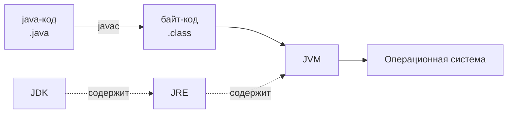

# 01. Основы языка Java

## Оглавление
- [[#Что такое Java|Что такое Java]]
- [[#Структура Java-программы|Структура Java-программы]]
- [[#Идентификаторы и ключевые слова|Идентификаторы и ключевые слова]]
- [[#Переменные|Переменные]]
- [[#Типы данных|Типы данных]]
- [[#Преобразование типов|Преобразование типов]]
- [[#Выведение типа через var|Выведение типа через var]]

## Что такое Java

Java — объектно-ориентированный язык программирования, созданный компанией Sun Microsystems (ныне Oracle) в 1995 году. Ключевая особенность — выполнение на виртуальной машине, что обеспечивает переносимость программ между платформами.

### История и назначение

- 1991 — проект Oak (James Gosling), язык для бытовой электроники.
- 1995 — выпуск Java 1.0 под названием Java.
- 2006 — открытие исходного кода (OpenJDK).
- С 2017 — полугодовой цикл релизов; каждая вторая версия — LTS (долгосрочная поддержка).
- Актуальные LTS: **Java 25 (сентябрь 2025)**, Java 21 (2023), Java 17, Java 11, Java 8. Ориентир этой базы — **Java 21**.

Назначение — надёжные серверные и корпоративные приложения, Android-разработка, большие распределённые системы. Сочетает строгую типизацию, автоматическое управление памятью и развитую стандартную библиотеку.

### JDK, JRE и JVM

| Компонент | Расшифровка | Что содержит |
| --- | --- | --- |
| **JDK** | Java Development Kit | Инструменты разработки: компилятор `javac`, JRE, библиотеки, утилиты (`jar`, `jlink`, `jpackage`) |
| **JRE** | Java Runtime Environment | Только выполнение: JVM и библиотеки классов |
| **JVM** | Java Virtual Machine | Виртуальная машина, исполняющая байт-код |



С Java 9 JRE отдельно не распространяется — для запуска программ достаточно JDK (в нём есть `java`).

### Компиляция и выполнение

```text
javac Hello.java   # компиляция: Hello.java -> Hello.class
java Hello         # запуск: JVM исполняет байт-код из Hello.class
```

Компилятор проверяет типы и синтаксис, затем выдаёт байт-код. Ошибки компиляции видны до запуска — это часть надёжности языка.

### Байткод

Байт-код — промежуточное представление программы: набор инструкций для JVM, не зависящий от конкретного процессора. Инструкции примитивны (`iload`, `iadd`, `invokevirtual`), поэтому байт-код компактнее исходного текста и одинаков на всех платформах.

### Принцип Write Once, Run Anywhere

Программа компилируется один раз в байт-код, а затем запускается на любой платформе, где установлена подходящая JVM (Windows, Linux, macOS). Переносимость обеспечивает именно JVM, а не сам код: JVM знает, как работать с конкретной ОС.

## Структура Java-программы

Всё, что есть в Java, находится внутри классов. Минимальная программа — класс с методом `main`.

### Класс

Класс — единица компиляции и организации кода. Имя файла обязано совпадать с именем публичного класса: файл `Hello.java` содержит `public class Hello`.

```java
public class Hello {
    // тело класса
}
```

### Метод `main`

Точка входа в программу. Сигнатура фиксирована:

```java
public static void main(String[] args) {
    System.out.println("Hello, World!");
}
```

- `public` — доступен JVM снаружи;
- `static` — вызывается без создания объекта;
- `void` — ничего не возвращает;
- `String[] args` — аргументы командной строки (см. [[04. Методы и параметры#Аргументы командной строки|аргументы командной строки]]).

### Инструкции и блоки

**Инструкция** (statement) — минимальная исполняемая единица, заканчивается точкой с запятой. **Блок** — группа инструкций в фигурных скобках `{}`, используется там, где ожидается одна инструкция.

```java
if (x > 0) {                    // блок из двух инструкций
    System.out.println("Положительное");
    x = 0;
}
```

### Точка с запятой

Каждая инструкция завершается `;`. Пропуск — ошибка компиляции. Исключение — управляющие конструкции (`if`, `for`, `while`) и блоки, где `;` не ставится после `}`.

### Разделители

Символы, организующие структуру кода:

| Символ | Назначение |
| --- | --- |
| `;` | конец инструкции |
| `{` `}` | блок кода |
| `(` `)` | параметры методов, условия, группировка выражений |
| `[` `]` | объявление/индексация массивов (см. [[03. Массивы и строки#Одномерные массивы|массивы]]) |
| `,` | разделение элементов списка |
| `.` | доступ к членам: `System.out.println`, `str.length()` |

### Комментарии

#### Однострочные

```java
// однострочный комментарий
int x = 42; // комментарий после кода
```

#### Многострочные

```java
/*
 * многострочный комментарий
 * занимает несколько строк
 */
```

#### Javadoc

Комментарии `/** ... */` перед классами и методами обрабатываются утилитой `javadoc` и порождают документацию в HTML.

```java
/**
 * Возвращает квадрат числа.
 *
 * @param n число
 * @return n * n
 */
int square(int n) { return n * n; }
```

Подробнее — [[15. JVM, память и профессиональная разработка#Документирование Javadoc|Javadoc]].

## Идентификаторы и ключевые слова

### Правила именования

- Начинается с буквы, `$` или `_`; далее буквы, цифры, `$`, `_`.
- Чувствителен к регистру: `count` и `Count` — разные имена.
- Не может совпадать с ключевым словом.
- Unicode-буквы допустимы (кириллица работает, но по соглашениям имена пишут латиницей).

Допустимо: `count`, `total_1`, `$price`, `MAX_VALUE`.
Недопустимо: `1num`, `class`, `my-name` (дефис).

### Зарезервированные слова

```text
abstract   assert      boolean    break      byte       case
catch      char        class      const      continue   default
do         double      else       enum       extends    final
finally    float       for        goto       if         implements
import     instanceof  int        interface  long       native
new        package     private    protected  public     return
short      static      strictfp   super      switch     synchronized
this       throw       throws     transient  try        void
volatile   while       true       false      null
```

`const` и `goto` зарезервированы, но не используются. `true`, `false`, `null` — литералы, их тоже нельзя использовать как имена.

### Контекстные ключевые слова

Отдельная группа — слова, которые становятся ключевыми только в определённом синтаксическом контексте. Их допустимо использовать как идентификаторы, но делать это не стоит:

| Слово | Версия | Где ключевое |
| --- | --- | --- |
| `var` | 10 | объявление локальной переменной (см. [[#Выведение типа через var|var]]) |
| `record` | 16 | объявление record (см. [[07. Интерфейсы, enum, record и sealed#Record|record]]) |
| `sealed`, `permits`, `non-sealed` | 17 | ограниченные иерархии (см. [[07. Интерфейсы, enum, record и sealed#Sealed classes|sealed]]) |
| `yield` | 14 | возврат значения из switch-выражения (см. [[02. Операторы и управление потоком#yield|yield]]) |
| `when` | 21 | guard-условие в pattern matching (см. [[02. Операторы и управление потоком#Pattern matching в switch|pattern matching]]) |

Символ `_` — с Java 9 нельзя использовать как идентификатор (был зарезервирован ранее).

### Соглашения Java Code Conventions

| Что | Соглашение | Пример |
| --- | --- | --- |
| Класс | UpperCamelCase | `ArrayList`, `HttpClient` |
| Метод | lowerCamelCase | `getTotal`, `printReport` |
| Переменная | lowerCamelCase | `totalCount`, `userName` |
| Константа | UPPER_SNAKE_CASE | `MAX_SIZE`, `DEFAULT_PORT` |
| Пакет | строчные | `com.example.app` |

## Переменные

### Объявление

Объявление связывает имя с типом. Без инициализации локальная переменная не готова к использованию.

```java
int count;              // объявление
double price, tax;      // несколько переменных одного типа
String name;            // ссылочный тип
```

### Инициализация

```java
int count = 10;                 // объявление + инициализация
double price = 99.5, tax = 0.2; // в одной строке
int x;
x = 5;                          // инициализация позже (локальная)
```

Динамическая инициализация — значение вычисляется в момент объявления:

```java
double hypotenuse = Math.sqrt(3 * 3 + 4 * 4);
```

### Область видимости

Область видимости (scope) — фрагмент кода, где переменная доступна. Локальные переменные видны только в блоке, где объявлены, и во вложенных блоках. Переменная, объявленная внутри блока, недоступна за его пределами.

```java
{
    int a = 1;
    {
        int b = 2;
        // a и b доступны
    }
    // b недоступна — ошибка компиляции
}
```

**Shadowing запрещён**: локальную переменную нельзя переобъявить с тем же именем во вложенном блоке (в отличие от C):

```java
int a = 1;
{
    // int a = 2;  // ошибка: a уже объявлена в этой области
}
```

Поле класса можно скрыть параметром метода — тогда поле доступно через `this` (см. [[05. Классы и объекты#Ключевое слово this|this]]).

### Время жизни

Локальная переменная существует, пока выполняется блок, в котором она объявлена; при выходе из блока память под неё освобождается (переменная «умирает»). Объекты же живут, пока на них есть ссылки, — их жизнью управляет сборщик мусора (см. [[15. JVM, память и профессиональная разработка#Garbage Collector|Garbage Collector]]).

### Локальные переменные

Объявляются внутри методов/блоков. Не имеют значений по умолчанию — обязательна инициализация до чтения, иначе ошибка компиляции.

```java
void demo() {
    int x;           // не инициализирована
    // System.out.println(x); // ошибка: возможно, не инициализирована
    x = 1;
    System.out.println(x); // ок
}
```

### Поля экземпляра

Объявлены в классе, вне методов. Каждый объект хранит собственную копию. Имеют значения по умолчанию (см. [[#Значения по умолчанию|значения по умолчанию]]). Подробно — [[05. Классы и объекты#Создание классов|создание классов]].

```java
class Counter {
    int value;        // поле экземпляра, по умолчанию 0
    String label;     // поле экземпляра, по умолчанию null
}
```

### Статические поля

Помечаются `static` — одна копия на весь класс, общая для всех объектов. Инициализируются один раз при загрузке класса. Подробно — [[05. Классы и объекты#Ключевое слово static|static]].

```java
class Config {
    static int instances = 0;   // общее для всех объектов
}
```

## Типы данных

Java — строго типизированный язык: тип каждой переменной известен на этапе компиляции. Есть два семейства типов: примитивные (8) и ссылочные.

### Примитивные типы

```mermaid
classDiagram
    class "Примитивные типы" {
        byte short int long
        float double
        char boolean
    }
```

| Тип | Размер | Диапазон | Назначение |
| --- | --- | --- | --- |
| `byte` | 8 бит | −128 … 127 | малые целые, байты данных |
| `short` | 16 бит | −32 768 … 32 767 | редко используемые малые целые |
| `int` | 32 бит | −2³¹ … 2³¹−1 | целые по умолчанию |
| `long` | 64 бит | −2⁶³ … 2⁶³−1 | большие целые (суффикс `L`) |
| `float` | 32 бит | ~±3.4e38, 7 знаков | вещественные низкой точности (суффикс `f`) |
| `double` | 64 бит | ~±1.8e308, 15–16 знаков | вещественные по умолчанию |
| `char` | 16 бит | 0 … 65 535 (UTF-16) | один символ |
| `boolean` | 1 бит (логически) | `true` / `false` | логическое значение |

#### `byte`

```java
byte b = 100;
byte c = (byte) 200; // переполнение: -56
```

#### `short`

```java
short s = 30_000;
```

#### `int`

```java
int i = 2_147_483_647; // максимум
```

#### `long`

```java
long big = 9_000_000_000L; // суффикс L обязателен, иначе int и переполнение
```

#### `float`

```java
float f = 1.5f; // суффикс f обязателен
```

#### `double`

```java
double d = 1.5; // вещественный литерал по умолчанию double
```

#### `char`

`char` хранит один символ в кодировке UTF-16. Может участвовать в арифметике как беззнаковое целое.

```java
char ch = 'A';
char code = 66;       // 'B'
char uni = '\u03A9';  // 'Ω'
```

**Подводный камень — суррогатные пары**: `char` — это 16-битный code unit, а не обязательно «символ». Символы вне Basic Multilingual Plane (эмодзи, редкие иероглифы) занимают **два** `char`:

```java
String s = "😀";
s.length()         // 2 — два code unit (суррогатная пара)
s.charAt(0)        // '\uD83D' — старший суррогат

// корректная работа с кодовыми точками
s.codePointCount(0, s.length());   // 1 — один символ
```

Для обработки текста по символам использовать `codePointAt`/`codePointCount` (см. [[03. Массивы и строки#Получение символов|получение символов]]).

#### `boolean`

```java
boolean ok = true;
boolean no = (10 > 5); // false
```

### Ссылочные типы

Ссылочные типы хранят ссылку (адрес) на объект в куче, а не само значение. К ним относятся классы, интерфейсы, массивы, enum, record. Переменная ссылочного типа либо ссылается на объект, либо равна `null`.

```java
String s = "hello";  // s — ссылка на объект String
int[] arr = new int[3]; // arr — ссылка на массив
```

Ссылочные типы делятся на два семейства по способу определения (см. [[07. Интерфейсы, enum, record и sealed|интерфейсы, enum, record и sealed]]):
- **Классы** — обычные, абстрактные, вложенные; иерархии через наследование (см. [[06. Наследование и полиморфизм|наследование]]).
- **Интерфейсы** — контракты поведения.
- **enum** — фиксированный набор констант.
- **record** — неизменяемые носители данных.
- **Массивы** — отдельный ссылочный тип (см. [[03. Массивы и строки|массивы]]).

Подробно про объекты — [[05. Классы и объекты#Ссылки на объекты|ссылки на объекты]].

### Значения по умолчанию

Поля (но не локальные переменные!) инициализируются автоматически:

| Тип | По умолчанию |
| --- | --- |
| `byte`, `short`, `int`, `long` | `0` |
| `float` | `0.0f` |
| `double` | `0.0` |
| `char` | `'\u0000'` (null-символ) |
| `boolean` | `false` |
| ссылочный | `null` |

```java
class Defaults {
    int i;      // 0
    double d;   // 0.0
    boolean b;  // false
    String s;   // null
}
```

### Литералы

Литерал — прямое значение в коде.

#### Целочисленные

```java
int dec = 42;        // десятичное
int oct = 052;       // восьмеричное (с 0)
int hex = 0x2A;      // шестнадцатеричное (0x)
int bin = 0b101010;  // двоичное (0b)
long big = 42L;      // long
```

#### Вещественные

```java
double d1 = 1.5;
double d2 = 1.5e3;   // 1500.0 (научная нотация)
float f = 1.5f;
```

#### Символьные

```java
char a = 'A';
char tab = '\t';   // управляющие: \n \t \b \r \f \' \" \\
char uni = '\u0041'; // 'A' по коду
```

#### Строковые

```java
String s = "Привет, Java";
String nl = "Строка1\nСтрока2"; // \n — перевод строки
```

#### Логические

```java
boolean t = true;
boolean f = false;
```

#### `null`

```java
String s = null; // ссылка ни на что
```

### Разделители чисел

С Java 7 допустим подчёркивания в числовых литералах для читаемости — в любом месте между цифрами (не в начале/конце и не рядом с точкой).

```java
int million = 1_000_000;
long creditCard = 1234_5678_9012_3456L;
double pi = 3.1415_9265;
```

### Двоичные, восьмеричные и шестнадцатеричные литералы

```java
int bin = 0b1101;    // 13
int oct = 0_77;      // 63 — неоднозначно, лучше 077
int hex = 0xFF;      // 255
```

Общий приём — битовые маски в шестнадцатеричном виде: `0x3F` нагляднее, чем `63` (см. [[02. Операторы и управление потоком#Побитовые операторы|побитовые операторы]]).

## Преобразование типов

### Неявное расширение

Автоматическое преобразование (widening) — когда целевой тип «шире» исходного и потери невозможны:

```java
byte b = 10;
int i = b;          // byte -> int, ок
long l = i;         // int -> long, ок
double d = l;       // long -> double, ок (точность int при long->double может страдать)
```

Порядок: `byte → short → int → long → float → double` и `char → int → …`.

### Явное приведение

Приведение (casting) сужающее — когда целевой тип «уже». Возможна потеря данных, компилятор не даёт неявно.

```java
double d = 9.99;
int i = (int) d;     // 9 — дробная часть отброшена
long l = 100;
int j = (int) l;     // сужение
```

### Потеря данных

При сужении значения «обрезаются» до диапазона целевого типа.

```java
int big = 300;
byte b = (byte) big;   // 44 — 300 по модулю 256
double d = 1.9;
int i = (int) d;       // 1 — не округление, а отбрасывание дробной части
```

### Числовые преобразования в выражениях

В арифметическом выражении Java автоматически повышает типы по правилам:

1. Если есть `double` — результат `double`.
2. Иначе если есть `float` — результат `float`.
3. Иначе если есть `long` — результат `long`.
4. Иначе — результат `int` (**даже если оба операнда `byte`/`short`/`char`**).

```java
byte a = 5, b = 10;
// byte c = a + b; // ошибка: a + b уже int
int c = a + b;     // ок

int i = 10;
double r = i / 4;  // 2.0, а не 2.5! i / 4 = 2 (int), затем в double
```

Подводный камень: чтобы получить 2.5, нужно делить `10.0 / 4` или `(double) i / 4`.

### Приведение `char`

`char` — беззнаковое 16-битное целое, поэтому ведёт себя как тип от 0 до 65535.

```java
char ch = 'A';      // 65
int code = ch;      // 65
char next = (char) (ch + 1); // 'B'
```

### Приведение ссылочных типов

Приведение ссылочных типов возможно только внутри иерархии наследования; иначе — `ClassCastException`. Нисходящее приведение должно проверяться через `instanceof` (см. [[06. Наследование и полиморфизм#Полиморфизм|полиморфизм]]).

```java
Object o = "строка";
String s = (String) o;      // ок: реальный тип — String
// Integer n = (Integer) o; // ClassCastException
```

## Выведение типа через `var`

С Java 10 локальные переменные можно объявлять через `var` — тип выводится компилятором из инициализатора.

### Основы `var`

```java
var name = "Java";       // String
var count = 42;          // int
var list = new ArrayList<String>(); // ArrayList<String>
var sum = (a, b) -> a + b; // BinaryOperator<Integer> (по контексту)
```

`var` — не динамический тип: тип фиксируется на этапе компиляции и не меняется.

### Ограничения

- Только для локальных переменных (и переменных цикла `for`).
- Обязательна инициализация: `var x;` — ошибка.
- Нельзя как `null` без типа: `var x = null;` — ошибка.
- Нельзя для полей класса, параметров методов, возвращаемых типов.

```java
var x = null;        // ошибка
var arr = new int[3]; // ок: int[]
for (var i = 0; i < 10; i++) { } // ок
```

### `var` и ссылочные типы

`var` сохраняет статический тип инициализатора. Неоднозначность `diamond` можно упрощать, но осторожно:

```java
var list = new ArrayList<>(); // ArrayList<Object> (без типа аргумента — Object)
var typed = new ArrayList<String>(); // ArrayList<String>
```

### `var` и наследование

Тип `var` — статический тип выражения, не реальный тип объекта.

```java
var obj = new ArrayList<String>(); // статический тип ArrayList<String>
obj = new LinkedList<String>();    // ок? Нет: LinkedList не подтип ArrayList
```

`var` не добавляет полиморфизма: объявить через `var` переменную типа интерфейса можно только если инициализатор имеет этот статический тип.

### Когда использовать и когда избегать

| Использовать | Избегать |
| --- | --- |
| Очевидный тип в правой части: `var map = new HashMap<String, List<Integer>>()` | Когда тип неясен из контекста и вреден для читаемости |
| Локальные промежуточные значения в длинных цепочках | В публичных API (поля, параметры) — там `var` запрещён |
| Упрощение громоздких generic-типов | С `null`, примитивами с неочевидным продвижением (`var d = 1.0f` vs `double`) |

Правило: `var` улучшает код, когда тип очевиден справа; ухудшает — когда скрывает важную информацию о типе.
