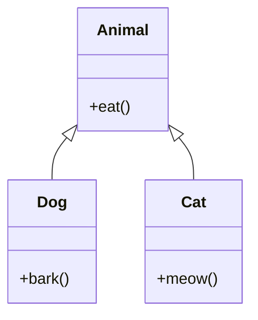
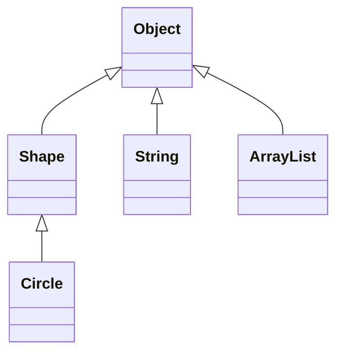

# 06. Наследование и полиморфизм

## Оглавление
- [[#Основы наследования|Основы наследования]]
- [[#Доступ к унаследованным членам|Доступ к унаследованным членам]]
- [[#Ключевое слово super|Ключевое слово super]]
- [[#Цепочка конструкторов|Цепочка конструкторов]]
- [[#Многоуровневое наследование|Многоуровневое наследование]]
- [[#Переопределение методов|Переопределение методов]]
- [[#Полиморфизм|Полиморфизм]]
- [[#Динамическая диспетчеризация методов|Динамическая диспетчеризация методов]]
- [[#Поля и скрытие членов|Поля и скрытие членов]]
- [[#Абстрактные классы|Абстрактные классы]]
- [[#final и наследование|final и наследование]]
- [[#Класс Object|Класс Object]]
- [[#Наследование против композиции|Наследование против композиции]]

## Основы наследования

Механизм построения класса на основе другого: подкласс получает члены суперкласса.

### `extends`

```java
class Animal {
    void eat() { System.out.println("ест"); }
}

class Dog extends Animal {
    void bark() { System.out.println("гав"); }
}

Dog d = new Dog();
d.eat();   // унаследованный метод
d.bark();
```

### Суперкласс и подкласс

Суперкласс (родитель, базовый) — класс, от которого наследуют. Подкласс (наследник, производный) — наследует члены и может добавлять свои или переопределять существующие.

### Отношение is-a

Наследование выражает отношение «является» (is-a): `Dog` — это `Animal`. Подкласс можно использовать везде, где ожидается суперкласс (см. [[#Полиморфизм|полиморфизм]]).



## Доступ к унаследованным членам

Подкласс видит `public` и `protected` члены суперкласса, а также package-private (если в том же пакете). `private` члены недоступны (см. [[05. Классы и объекты#Управление доступом|управление доступом]]).

## Ключевое слово `super`

`super` — ссылка на экземпляр суперкласса (часть текущего объекта).

### Доступ к членам суперкласса

```java
class Child extends Parent {
    void show() {
        super.display();   // метод суперкласса
    }
}
```

### Вызов метода суперкласса

Нужен, когда подкласс переопределил метод и хочет вызвать версию родителя:

```java
class Parent {
    String greet() { return "Привет"; }
}
class Child extends Parent {
    @Override
    String greet() { return super.greet() + ", мир!"; }
}
```

### Вызов конструктора

`super(...)` вызывает конструктор суперкласса и обязан быть первой инструкцией.

```java
class Animal {
    Animal(String name) { }
}
class Dog extends Animal {
    Dog(String name) { super(name); }
}
```

### `super` в статическом контексте

`super` недоступен в статических методах (как и `this` — нет экземпляра): статические методы суперкласса скрываются, а не вызываются через `super` (см. [[#Static method hiding|static method hiding]]).

## Цепочка конструкторов

При создании объекта вызываются конструкторы всей цепочки: от самого верхнего суперкласса вниз. Если `super(...)` не вызван явно, компилятор вставляет вызов конструктора без параметров суперкласса; если такого нет — ошибка.

```java
class A { A() { System.out.println("A"); } }
class B extends A { B() { System.out.println("B"); } }
class C extends B { C() { System.out.println("C"); } }

new C();   // выведет: A B C
```

## Многоуровневое наследование

Цепочка наследования может быть сколь угодно длинной:

```java
class Animal { }
class Mammal extends Animal { }
class Dog extends Mammal { }
```

Каждый класс имеет ровно один прямой суперкласс — множественное наследование классов в Java запрещено (в отличие от интерфейсов, см. [[07. Интерфейсы, enum, record и sealed#Множественная реализация интерфейсов|множественную реализацию интерфейсов]]).

## Переопределение методов

Подкласс переопределяет метод суперкласса, давая новую реализацию с той же сигнатурой.

### `@Override`

Аннотация-подсказка компилятору: если метод на самом деле не переопределяет ничего — ошибка компиляции. Обязательна по соглашению.

```java
class Shape {
    double area() { return 0; }
}
class Circle extends Shape {
    @Override
    double area() { return Math.PI * r * r; }
}
```

### Правила переопределения

- Та же сигнатура (имя и параметры).
- Возвращаемый тип — тот же или ковариантный (см. ниже).
- Модификатор доступа не может быть строже, чем у суперкласса (см. [[#Модификаторы доступа|модификаторы доступа]]).
- Нельзя переопределить `static` метод или `final` метод (см. [[#final и наследование|final и наследование]]).
- Переопределяющий метод не может бросать более широкие checked исключения (см. [[08. Исключения и обработка ошибок#Исключения и переопределение методов|исключения и переопределение]]).

### Ковариантные возвращаемые типы

Подкласс может сузить возвращаемый тип:

```java
class Animal {
    Animal copy() { return new Animal(); }
}
class Dog extends Animal {
    @Override
    Dog copy() { return new Dog(); }   // ковариантный возврат
}
```

### Модификаторы доступа

Подкласс не может уменьшать видимость: `public` нельзя переопределить как `protected`. Расширять — можно.

## Полиморфизм

Способность объектов разных типов реагировать на один и тот же вызов по-своему.

### Ссылка суперкласса на объект подкласса

```java
Animal a = new Dog();   // ok
a.eat();                // вызовется реализация Dog, если переопределена
```

### Upcasting

Присваивание объекта подкласса ссылке суперкласса — всегда безопасно, происходит неявно.

### Downcasting

Обратное приведение (суперкласс → подкласс) требует явного приведения и проверки:

```java
Animal a = new Dog();
Dog d = (Dog) a;              // ок, реальный тип Dog
// Cat c = (Cat) a;           // ClassCastException
```

### `instanceof`

Проверка реального типа перед downcasting:

```java
if (a instanceof Dog) {
    Dog d = (Dog) a;
    d.bark();
}
```

**`null instanceof T` всегда `false`** — проверку можно не оборачивать в null-условие:

```java
Dog d = null;
d instanceof Dog   // false (не исключение!)
```

`instanceof` проверяет **реальный** тип объекта, а не тип ссылки — поэтому `a instanceof Animal` истинно и для `Dog`.

### Pattern matching для `instanceof`

С Java 16 проверка и приведение объединяются:

```java
if (a instanceof Dog d) {
    d.bark();   // d уже доступен
}
```

```java
Animal a = getAnimal();
switch (a) {
    case Dog d -> d.bark();
    case Cat c -> c.meow();
    default    -> a.eat();
}
```

## Динамическая диспетчеризация методов

Выбор реализации переопределённого метода происходит **во время выполнения** на основе реального типа объекта, а не типа ссылки:

```java
class Shape { double area() { return 0; } }
class Square extends Shape {
    double area() { return side * side; }
}

Shape s = new Square();
s.area();   // вызывается Square.area — динамическая диспетчеризация
```

## Поля и скрытие членов

Поля не полиморфны: они не переопределяются, а **скрываются**.

### Field hiding

Поле подкласса с тем же именем скрывает поле суперкласса. Выбор поля зависит от типа ссылки:

```java
class A { int x = 1; }
class B extends A { int x = 2; }

A ref = new B();
ref.x        // 1 — поле по типу ссылки (A)
B refB = new B();
refB.x       // 2
```

### Static method hiding

Статические методы тоже скрываются (не переопределяются): вызов идёт по типу ссылки, а не по реальному типу.

```java
class A { static void who() { System.out.println("A"); } }
class B extends A { static void who() { System.out.println("B"); } }

A.who();   // "A"
B.who();   // "B"
```

## Абстрактные классы

### `abstract class` и абстрактные методы

Класс, который нельзя инстанциировать. Может содержать абстрактные методы (без реализации) и обычные.

```java
abstract class Shape {
    abstract double area();           // без тела

    void describe() {                 // обычный метод
        System.out.println("Площадь: " + area());
    }
}
```

### Реализация в подклассах

Конкретный подкласс обязан реализовать все абстрактные методы, иначе сам должен быть абстрактным.

```java
class Circle extends Shape {
    double area() { return Math.PI * r * r; }
}
```

### Конструкторы абстрактных классов

Абстрактные классы имеют конструкторы — они вызываются через `super(...)` при создании экземпляра подкласса (см. [[#Цепочка конструкторов|цепочку конструкторов]]).

## `final` и наследование

### Финальные методы

`final`-метод нельзя переопределить — защита ключевой логики.

```java
class Base {
    final void init() { /* критичная инициализация */ }
}
```

### Финальные классы

`final`-класс нельзя наследовать — например, `String`, `Integer` (см. [[05. Классы и объекты#Ключевое слово final|final]]).

```java
final class ImmutablePoint { }
// class Sub extends ImmutablePoint { }  // ошибка
```

## Класс `Object`

Корень иерархии: каждый класс неявно наследует `Object` (см. [[15. JVM, память и профессиональная разработка#JVM|JVM]]).



### `toString`

Строковое представление объекта. По умолчанию — `ИмяКласса@хэш`. Переопределяют для читаемого вывода:

```java
class Point {
    int x, y;
    @Override
    public String toString() {
        return "Point(" + x + ", " + y + ")";
    }
}
```

### `equals` и `hashCode`

По умолчанию `equals` сравнивает ссылки. Для сравнения по содержимому переопределяют вместе с `hashCode` (см. [[#Контракт equals/hashCode|контракт]]).

```java
@Override
public boolean equals(Object o) {
    if (this == o) return true;
    if (o == null || getClass() != o.getClass()) return false;
    Point p = (Point) o;
    return x == p.x && y == p.y;
}
```

### `getClass`

Возвращает объект `Class`, описывающий реальный тип во время выполнения:

```java
Object o = "строка";
o.getClass()          // class java.lang.String
```

### Контракт `equals/hashCode`

1. Если объекты равны по `equals`, их `hashCode` **обязаны** совпадать.
2. Равные `hashCode` не гарантируют равенства (коллизии допустимы).

Нарушение контракта ломает `HashMap`/`HashSet` (см. [[10. Коллекции и структуры данных#Контракт equals/hashCode в коллекциях|контракт в коллекциях]]).

```java
@Override
public int hashCode() {
    return Objects.hash(x, y);
}
```

С Java 7 удобно использовать `Objects.hash` (см. [[13. Дата, время, числа и полезные API#Дополнительные утилиты|Objects]]).

### `equals`/`hashCode` и наследование (подводный камень)

Классическая ловушка — переопределение `equals` в подклассе с расширением состояния. Проверка `getClass() != o.getClass()` ломает «равенство» объектов подкласса, а `instanceof` — нарушает **симметрию** контракта:

```java
class Point {
    int x;
    // equals через getClass()
}
class ColoredPoint extends Point {
    String color;
}

Point p = new Point(1);
Point cp = new ColoredPoint(1, "red");
p.equals(cp)   // true (только x)
cp.equals(p)   // false (ещё и color) — асимметрия!
```

Практика: либо не расширять классы с переопределённым `equals` (композиция вместо наследования, см. [[#Наследование против композиции|композицию]]), либо делать `equals` на основе `instanceof` без расширения состояния. Готовое решение — `record` (см. [[07. Интерфейсы, enum, record и sealed#Record|record]]): `equals` там генерируется по всем компонентам.

### Остальные методы `Object`

- `wait`/`notify`/`notifyAll` — синхронизация потоков через монитор (см. [[14. Многопоточность и конкурентность#Мониторы|мониторы]]).
- `clone` — устаревший механизм копирования (см. [[03. Массивы и строки#Копирование массивов|clone массивов]]); в современных классах заменяется копирующим конструктором (см. [[05. Классы и объекты#Копирующий конструктор|копирующий конструктор]]).
- `finalize` — устарел и удалён (Java 18), не использовать.

## Наследование против композиции

| Критерий | Наследование | Композиция |
| --- | --- | --- |
| Отношение | is-a («собака — это животное») | has-a («машина имеет двигатель») |
| Связность | жёсткая, ломается при изменениях родителя | гибкая, заменяемая |
| Множественность | один суперкласс | несколько компонентов |
| Инкапсуляция | подкласс зависит от деталей родителя | скрыта за интерфейсами |
| Когда | настоящая иерархия и переиспользование поведения | «переиспользовать реализацию» — не причина |

```java
// композиция вместо наследования
class Car {
    private Engine engine = new Engine();  // has-a
    void start() { engine.ignite(); }
}
```

Общее правило: наследование оправдано, когда выполняется is-a и подкласс действительно «является» суперклассом; в остальных случаях — композиция (см. [[15. JVM, память и профессиональная разработка#Базовые принципы дизайна|принципы дизайна]]).
