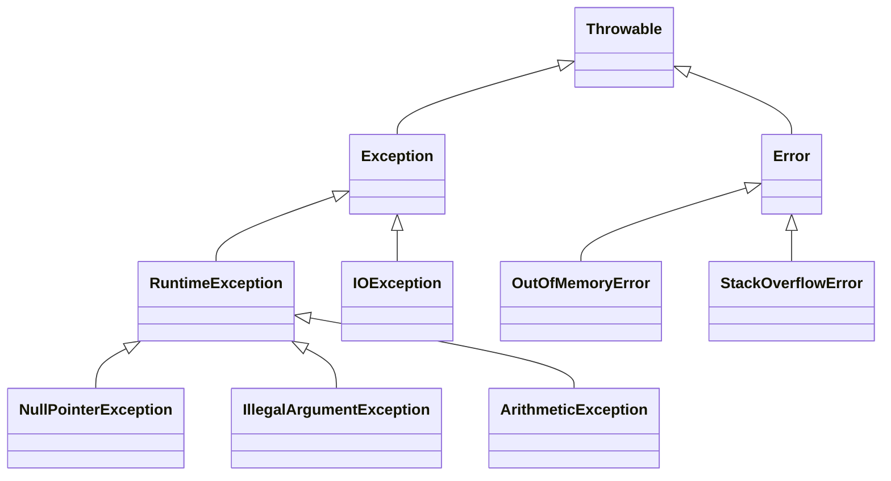

# 08. Исключения и обработка ошибок

## Оглавление
- [[#Иерархия исключений|Иерархия исключений]]
- [[#Checked exceptions|Checked exceptions]]
- [[#Unchecked exceptions|Unchecked exceptions]]
- [[#try и catch|try и catch]]
- [[#Несколько catch|Несколько catch]]
- [[#Multi-catch|Multi-catch]]
- [[#finally|finally]]
- [[#throw|throw]]
- [[#throws|throws]]
- [[#Создание собственных исключений|Создание собственных исключений]]
- [[#Повторное выбрасывание исключений|Повторное выбрасывание исключений]]
- [[#Цепочки исключений|Цепочки исключений]]
- [[#Try-with-resources|Try-with-resources]]
- [[#Исключения и переопределение методов|Исключения и переопределение методов]]
- [[#Практика проектирования исключений|Практика проектирования исключений]]

## Иерархия исключений

Корень — класс `Throwable`; под ним два семейства: `Error` и `Exception`.



### `Throwable`

Базовый класс всех объектов, которые можно бросить (`throw`) и поймать (`catch`).

### `Error`

Серьёзные проблемы JVM, обрабатывать не следует: `OutOfMemoryError`, `StackOverflowError` (см. [[04. Методы и параметры#StackOverflowError|StackOverflowError]]).

### `Exception`

Ошибки программы, которые стоит обрабатывать. Делится на checked и unchecked.

### `RuntimeException`

Неконтролируемые исключения — ошибки логики программы (см. [[#Unchecked exceptions|unchecked]]).

## Checked exceptions

Компилятор **требует** их обработать (`try/catch`) или объявить (`throws`). Типичны для ввода-вывода: `IOException`, `FileNotFoundException` (см. [[12. Ввод-вывод, файлы и сериализация|ввод-вывод]]).

```java
void readFile(String path) throws IOException {   // объявлено
    Files.readString(Path.of(path));
}
```

## Unchecked exceptions

Наследники `RuntimeException`. Обрабатывать не обязательно. Возникают при ошибках логики: `NullPointerException`, `IllegalArgumentException`, `ArithmeticException`, `IndexOutOfBoundsException`.

```java
int[] a = new int[3];
int x = a[10];   // ArrayIndexOutOfBoundsException — не требует обработки
```

## `try` и `catch`

```java
try {
    int r = 10 / 0;
} catch (ArithmeticException e) {
    System.out.println("Деление на ноль: " + e.getMessage());
}
```

Если исключение не поймано ни одним `catch` — распространяется вверх по стеку вызовов.

## Несколько `catch`

Порядок важен: более специфичное исключение должно идти раньше общего.

```java
try {
    readFile(path);
} catch (FileNotFoundException e) {
    System.out.println("Файл не найден");
} catch (IOException e) {
    System.out.println("Ошибка ввода-вывода");
}
```

Если `catch (IOException)` поставить первым — `FileNotFoundException` никогда не обработается отдельно.

## Multi-catch

С Java 7 один блок ловит несколько несвязанных типов (через `|`):

```java
try {
    // операции
} catch (IOException | SQLException e) {
    e.printStackTrace();
}
```

Типы в multi-catch не могут быть в отношении наследования (тогда нужен общий предок).

## `finally`

Выполняется **всегда** — и при нормальном завершении, и при исключении, и при `return`. Для освобождения ресурсов.

```java
try {
    risky();
} finally {
    System.out.println("Всегда выполнится");
}
```

Современная альтернатива для ресурсов — try-with-resources (см. [[#Try-with-resources|try-with-resources]]).

## `throw`

Явное выбрасывание исключения:

```java
void setAge(int age) {
    if (age < 0) {
        throw new IllegalArgumentException("Возраст не может быть отрицательным");
    }
}
```

## `throws`

Объявление в сигнатуре: метод может бросить проверяемое исключение.

```java
void connect() throws IOException { ... }
```

Если метод бросает несколько checked исключений — перечисляются через запятую. Перечислять unchecked не требуется.

## Создание собственных исключений

Наследуют `Exception` (checked) или `RuntimeException` (unchecked):

```java
class InsufficientFundsException extends RuntimeException {
    public InsufficientFundsException(String message) {
        super(message);
    }
}
```

Практика: доменные исключения с говорящими именами и удобными конструкторами.

## Повторное выбрасывание исключений

Поймав, можно перебросить то же или обёрнутое исключение:

```java
try {
    risky();
} catch (IOException e) {
    System.out.println("Логируем");
    throw e;   // переброс
}
```

С Java 7 точный повторный проброс (precise rethrow) сохраняет конкретный тип для `throws`.

## Цепочки исключений

Сохранение причины исходной ошибки.

### `getCause`

```java
try {
    doWork();
} catch (SQLException e) {
    throw new ServiceException("Не удалось сохранить", e);   // причина
}
```

### Конструкторы с причиной

У большинства исключений есть конструктор `(String message, Throwable cause)`. Причина доступна через `e.getCause()` — полезна при отладке.

## Try-with-resources

С Java 7 — автоматическое закрытие ресурсов, реализующих `AutoCloseable`.

### `AutoCloseable`

Интерфейс с единственным методом `close()`. Реализуют потоки, файлы, соединения (см. [[12. Ввод-вывод, файлы и сериализация|ввод-вывод]]).

### Автоматическое закрытие ресурсов

```java
try (var br = new BufferedReader(new FileReader("data.txt"))) {
    String line = br.readLine();
    System.out.println(line);
}
// br.close() вызывается автоматически, даже при исключении
```

Несколько ресурсов:

```java
try (var in = new FileInputStream("a.bin");
     var out = new FileOutputStream("b.bin")) {
    in.transferTo(out);
}
```

### Suppressed exceptions

Если при закрытии ресурса бросается исключение, оно добавляется как suppressed к основному. Доступны через `e.getSuppressed()`. Это важно: исключение из `close()` не должно «съедать» исключение из тела.

## Исключения и переопределение методов

Переопределяющий метод не может бросать **более широкие** checked исключения, чем метод суперкласса (см. [[06. Наследование и полиморфизм#Переопределение методов|переопределение]]).

```java
class Base {
    void work() throws IOException { }
}
class Sub extends Base {
    @Override
    void work() throws IOException { }   // ок
    // void work() throws Exception { }  // ошибка: шире IOException
}
```

Unchecked исключения этим правилом не ограничены.

## Практика проектирования исключений

- Использовать исключения для **исключительных** ситуаций, не для обычного потока управления.
- Проверять входные данные заранее (`if (x < 0) throw ...`) вместо глубоких каскадов исключений.
- Ловить как можно уже; не глотать исключения пустым `catch`.
- Обёртывать низкоуровневые исключения в доменные (см. [[#Цепочки исключений|цепочки]]), сохраняя причину.
- Не использовать исключения для завершения циклов и не обрабатывать `Error`.
- Документировать броски в Javadoc через `@throws` (см. [[15. JVM, память и профессиональная разработка#Документирование Javadoc|Javadoc]]).
