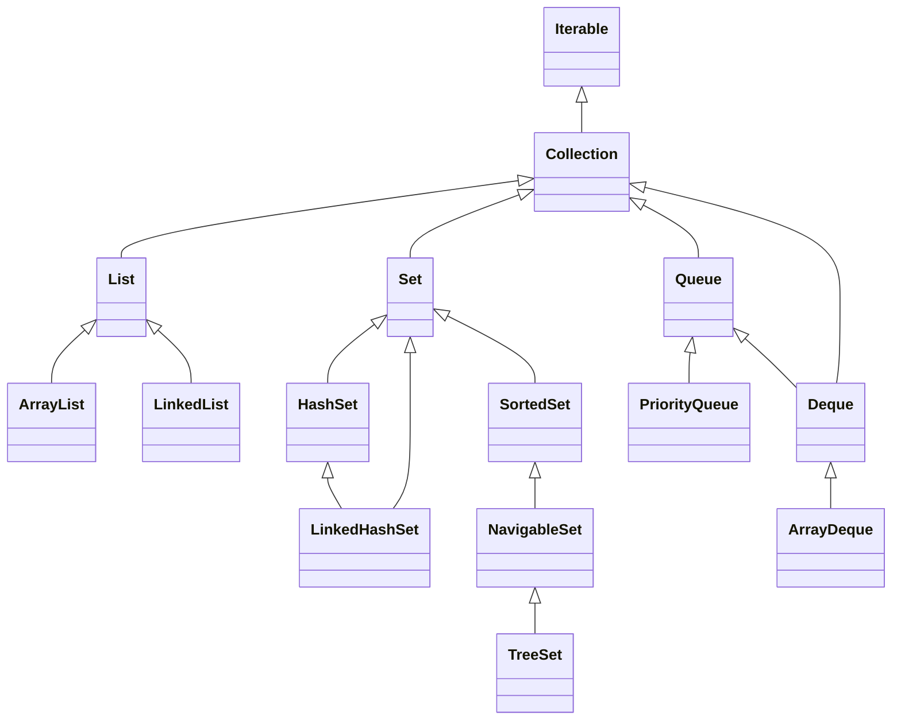
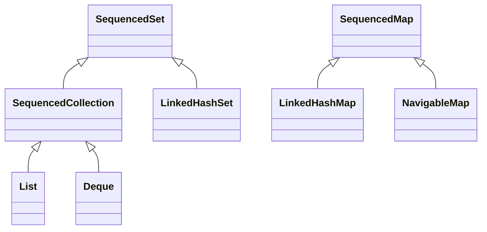

# 10. Коллекции и структуры данных

## Оглавление
- [[#Collection Framework|Collection Framework]]
- [[#Интерфейс Collection|Интерфейс Collection]]
- [[#List|List]]
- [[#Set|Set]]
- [[#Queue и Deque|Queue и Deque]]
- [[#Map|Map]]
- [[#NavigableSet и NavigableMap|NavigableSet и NavigableMap]]
- [[#Итераторы|Итераторы]]
- [[#Сортировка|Сортировка]]
- [[#Класс Collections|Класс Collections]]
- [[#Неизменяемые коллекции|Неизменяемые коллекции]]
- [[#EnumSet и EnumMap|EnumSet и EnumMap]]
- [[#Sequenced Collections|Sequenced Collections]]
- [[#WeakHashMap и IdentityHashMap|WeakHashMap и IdentityHashMap]]
- [[#Контракт equals/hashCode в коллекциях|Контракт equals/hashCode в коллекциях]]
- [[#Выбор подходящей коллекции|Выбор подходящей коллекции]]
- [[#Производительность коллекций|Производительность коллекций]]

## Collection Framework

Единая архитектура интерфейсов и реализаций для хранения и обработки групп объектов.



`Map` — отдельная ветвь (пары «ключ-значение»), не наследник `Collection`, но часть Framework.

Верхушка иерархии — `Iterable`: интерфейс «можно перебирать», дающий `iterator()` и (через default-метод) `forEach` (см. [[#Итераторы|итераторы]]).

Все интерфейсы и реализации — обобщённые (см. [[09. Обобщения и система типов|generics]]). С Java 8 у интерфейсов есть default-методы, поэтому, например, `removeIf` и `replaceAll` доступны всем коллекциям сразу.

## Интерфейс `Collection`

Базовый интерфейс групп элементов. Основные операции: `add`, `remove`, `contains`, `size`, `isEmpty`, `clear`, `iterator`.

```java
Collection<String> col = new ArrayList<>();
col.add("a");
col.contains("a");   // true
col.size();          // 1
```

## List

Упорядоченная коллекция с индексами; допускает дубликаты и `null`.

### ArrayList

Список на основе динамического массива. Быстрый доступ по индексу, медленная вставка/удаление в середине.

```java
List<String> list = new ArrayList<>();
list.add("a");
list.add("b");
list.get(0);          // "a"
list.set(1, "c");     // замена
list.remove(0);
list.size();
```

### LinkedList

Двусвязный список. Быстрая вставка/удаление в начале и конце, медленный доступ по индексу. На практике часто уступает `ArrayList` из-за кэш-промахов и хранения ссылок на соседей (см. [[#Производительность коллекций|производительность]]).

```java
List<String> ll = new LinkedList<>();   // объявлять через интерфейс List
ll.addFirst("start");                   // специфично для Deque
ll.addLast("end");
ll.getFirst();                          // "start"
```

**Важно**: `LinkedList` реализует и `List`, и `Deque`, поэтому у него есть методы обеих веток. Если нужен двусторонний список без индексов — используйте `ArrayDeque` (см. [[#Queue и Deque|Queue и Deque]]).

### Операции

```java
// индексация
list.get(i);
list.indexOf("b");     // индекс первого вхождения

// добавление
list.add("x");         // в конец
list.add(0, "y");      // по индексу (в ArrayList — O(n) сдвиг)

// удаление
list.remove("x");      // по объекту
list.remove(0);        // по индексу

// поиск
list.contains("a");

// условное удаление (default-метод, Java 8+)
list.removeIf(s -> s.length() < 2);

// итерация
for (String s : list) { ... }
list.forEach(System.out::println);
```

Выбор между `ArrayList` и `LinkedList` — см. [[#Выбор подходящей коллекции|таблицу выбора]].

## Set

Коллекция без дубликатов. Порядок зависит от реализации.

### HashSet

Хэш-таблица: O(1) для основных операций. Порядок не гарантирован.

```java
Set<String> set = new HashSet<>();
set.add("a");
set.add("a");     // дубликат не добавится
set.size();       // 1
```

### LinkedHashSet

Как `HashSet`, но сохраняет порядок вставки.

### TreeSet

Отсортированный набор (красно-чёрное дерево). Элементы должны быть сравнимы (`Comparable` или переданный `Comparator`, см. [[#Сортировка|сортировку]]).

```java
TreeSet<Integer> ts = new TreeSet<>();
ts.add(3); ts.add(1); ts.add(2);
ts.first();   // 1
ts.last();    // 3
```

## Queue и Deque

### PriorityQueue

Очередь с приоритетом: элемент с наименьшим приоритетом (по `Comparator`) извлекается первым.

```java
PriorityQueue<Integer> pq = new PriorityQueue<>();
pq.add(3); pq.add(1); pq.add(2);
pq.poll();   // 1 — наименьший
```

### ArrayDeque

Двусторонняя очередь на массиве. Основные операции:

```java
ArrayDeque<String> dq = new ArrayDeque<>();
dq.addFirst("a");
dq.addLast("b");
dq.pollFirst();   // "a"
dq.pollLast();    // "b"
```

### Использование как стек и очередь

```java
// как стек (LIFO)
ArrayDeque<String> stack = new ArrayDeque<>();
stack.push("1");
stack.push("2");
stack.pop();      // "2"

// как очередь (FIFO)
ArrayDeque<String> queue = new ArrayDeque<>();
queue.offer("1");
queue.offer("2");
queue.poll();     // "1"
```

`ArrayDeque` предпочтительнее `Stack` (устаревший) и для очередей обычно лучше `LinkedList`.

## Map

Пара «ключ-значение». Ключи уникальны.

### HashMap

Хэш-таблица: O(1) для `get`/`put`. Порядок не гарантирован.

```java
Map<String, Integer> map = new HashMap<>();
map.put("apple", 5);
map.put("banana", 3);
map.get("apple");         // 5
map.containsKey("apple"); // true
map.getOrDefault("cherry", 0); // 0
```

### Продвинутые методы `Map` (Java 8+)

Ходовые методы для безопасной работы с отсутствующими ключами:

```java
map.putIfAbsent("apple", 10);   // кладёт, только если ключа ещё нет

map.computeIfAbsent("orange", k -> computePrice(k)); // ленивое вычисление, если ключа нет
// эквивалент без гонок:
// if (!map.containsKey(k)) map.put(k, compute(k));

map.computeIfPresent("apple", (k, v) -> v + 1); // обновить, если ключ есть

map.merge("apple", 1, Integer::sum);   // если ключа нет — положить 1,
                                       // если есть — применить функцию
```

`computeIfAbsent`/`merge` — атомарны, что удобно для кэшей и счётчиков (см. [[14. Многопоточность и конкурентность#Concurrent collections|concurrent collections]]).

### LinkedHashMap

Сохраняет порядок вставки записей. Второй конструктор с `accessOrder` позволяет LRU-кэш (записи упорядочены по последнему доступу):

```java
Map<String, Integer> lru = new LinkedHashMap<>(16, 0.75f, true);
```

### TreeMap

Отсортированная карта по ключу (красно-чёрное дерево). Ключи сравнимы (`Comparable` или `Comparator`). Помимо `get`/`put` даёт навигацию — см. [[#NavigableSet и NavigableMap|NavigableMap]].

### Hashtable

Устаревшая потокобезопасная карта. Вместо неё — `ConcurrentHashMap` (см. [[14. Многопоточность и конкурентность#Concurrent collections|concurrent collections]]).

Итерация по `Map`:

```java
for (var e : map.entrySet()) {
    System.out.println(e.getKey() + "=" + e.getValue());
}
map.forEach((k, v) -> System.out.println(k + "=" + v));
```

## NavigableSet и NavigableMap

Интерфейсы навигации для упорядоченных `TreeSet`/`TreeMap` (расширяют `SortedSet`/`SortedMap`). Позволяют находить «ближайшие» элементы:

```java
TreeSet<Integer> ts = new TreeSet<>(Set.of(1, 5, 8, 20));

ts.floor(6);       // 5   — наибольший <= 6
ts.ceiling(6);     // 8   — наименьший >= 6
ts.lower(5);       // 1   — строго меньше
ts.higher(5);      // 8   — строго больше
ts.subSet(1, 8);   // {1, 5}    — диапазон [from, to)
ts.headSet(8);     // {1, 5}
ts.tailSet(5);     // {5, 8, 20}
ts.pollFirst();    // 1   — извлечь наименьший
ts.pollLast();     // 20  — извлечь наибольший
```

```java
TreeMap<String, Integer> tm = new TreeMap<>();
tm.floorKey("k");       // наибольший ключ <= "k"
tm.ceilingEntry("k");   // запись с наименьшим ключом >= "k"
```

Это типовой инструмент для задач «ближайшее значение», интервалов и упорядоченных диапазонов.

## Итераторы

### `Iterator`

Последовательный обход с удалением:

```java
Iterator<String> it = list.iterator();
while (it.hasNext()) {
    String s = it.next();
    if (s.equals("x")) it.remove();
}
```

Удаление через `it.remove()` безопасно; удаление через `list.remove` во время итерации — `ConcurrentModificationException`.

### Fail-fast и fail-safe

- **Fail-fast** — стандартные коллекции: при структурной модификации во время итерации бросают `ConcurrentModificationException`. Это защита от ошибок, а не гарантия поведения.
- **Fail-safe** — concurrent-коллекции (`ConcurrentHashMap`, `CopyOnWriteArrayList`, см. [[14. Многопоточность и конкурентность#Concurrent collections|concurrent]]): итерируют по снимку или слабо согласованно, не бросают, но могут не увидеть свежие изменения.

Альтернатива ручной итерации с удалением — `removeIf` (см. [[#Операции|операции List]]).

### `ListIterator`

Двусторонний итератор для `List`:

```java
ListIterator<String> li = list.listIterator();
li.hasNext();
li.hasPrevious();
li.add("insert");
```

### `forEach`

С Java 8 — лямбда-обход (см. [[11. Лямбда-выражения и Stream API|лямбды]]):

```java
list.forEach(System.out::println);
```

## Сортировка

### `Comparable`

Естественный порядок: класс реализует `compareTo`:

```java
record Product(String name, double price) implements Comparable<Product> {
    public int compareTo(Product o) {
        return Double.compare(this.price, o.price);
    }
}

List<Product> products = ...;
Collections.sort(products);   // по цене
```

### `Comparator`

Внешний компаратор — без изменения класса:

```java
list.sort(Comparator.comparing(Product::name));
list.sort(Comparator.comparingDouble(Product::price));
```

### Составные компараторы

```java
list.sort(Comparator.comparing(Product::price)
        .reversed()
        .thenComparing(Product::name));
```

## Класс `Collections`

Статические утилиты над коллекциями.

### Сортировка

```java
Collections.sort(list);               // по естественному порядку
Collections.sort(list, comparator);   // по компаратору
```

### Поиск

```java
int i = Collections.binarySearch(sortedList, key);
```

### Перемешивание

```java
Collections.shuffle(list);
```

### Минимум и максимум

```java
Collections.min(list);
Collections.max(list, comparator);
```

### Неизменяемые обёртки

Обёртки «поверх» существующей коллекции: бросают исключение при попытке модификации, но **видят изменения источника**:

```java
List<String> unmod = Collections.unmodifiableList(list);
// unmod.add("x");  // UnsupportedOperationException
list.add("z");      // unmod тоже "увидит" добавление (это обёртка)
```

### Пустые и одноэлементные коллекции

```java
List<String> empty = Collections.emptyList();       // без аллокации
Set<Integer> one = Collections.singleton("x");      // фиксированный размер 1
```

Возвращать `Collections.emptyList()` вместо `null` — хорошая практика (см. [[13. Дата, время, числа и полезные API#Optional|Optional]]).

## Неизменяемые коллекции

С Java 9 — фабрики неизменяемых коллекций:

### `List.of`, `Set.of`, `Map.of`

```java
List<String> list = List.of("a", "b");      // неизменяемый
Set<Integer> set = Set.of(1, 2, 3);
Map<String, Integer> map = Map.of("a", 1, "b", 2);
Map<String, Integer> map2 = Map.ofEntries(Map.entry("a", 1));
```

`null` в этих фабриках запрещён.

### Отличие от `unmodifiableList`

`Collections.unmodifiableList` — обёртка над существующей коллекцией (изменения источника видны). `List.of`/`copyOf` — **независимые** копии: исходная коллекция может меняться, неизменяемая — нет.

### `copyOf`

Неизменяемая копия существующей коллекции:

```java
List<String> copy = List.copyOf(list);   // не зависит от list
Set<String> s = Set.copyOf(set);
Map<String, Integer> m = Map.copyOf(map);
```

## EnumSet и EnumMap

Специализированные коллекции для `enum` — самые быстрые и компактные в Java.

```java
enum Status { NEW, ACTIVE, DONE }

EnumSet<Status> active = EnumSet.of(Status.NEW, Status.ACTIVE);
EnumSet<Status> all = EnumSet.allOf(Status.class);   // все константы
EnumSet<Status> rest = EnumSet.complementOf(active); // все, кроме перечисленных

EnumMap<Status, String> label = new EnumMap<>(Status.class);
label.put(Status.NEW, "Новый");
```

`EnumSet` реализован битовыми масками — O(1) для всех операций. `EnumMap` — массивом по `ordinal`, быстрее `HashMap` (см. [[07. Интерфейсы, enum, record и sealed#Enum|enum]]).

## Sequenced Collections

Интерфейсы, добавленные в Java 21, для коллекций с определённым порядком элементов. Обеспечивают единый доступ к первому/последнему элементу и обратную итерацию:



### `SequencedCollection`

```java
SequencedCollection<String> seq = new ArrayList<>();
seq.addFirst("a");            // добавить в начало
seq.addLast("z");             // добавить в конец
seq.getFirst();               // "a"
seq.getLast();                // "z"
seq.removeFirst();            // удалить и вернуть первый
seq.reversed();               // обратный视图 (не копия)
```

### `SequencedSet`

`LinkedHashSet` теперь реализует `SequencedSet` — гарантированный порядок вставки с доступом к первому/последнему:

```java
SequencedSet<String> set = new LinkedHashSet<>();
set.add("b"); set.add("a");
set.getFirst();        // "b"
set.getLast();         // "a"
```

### `SequencedMap`

```java
SequencedMap<String, Integer> map = new LinkedHashMap<>();
map.putFirst("a", 1);
map.putLast("z", 26);
map.firstEntry();      // Map.entry("a", 1)
map.lastEntry();       // Map.entry("z", 26)
map.pollFirstEntry();  // удалить и вернуть первую
map.reversed();        // обратный порядок
```

## WeakHashMap и IdentityHashMap

### `WeakHashMap`

Карта, в которой ключи хранятся через `WeakReference`. Если на ключ нет сильных ссылок вне карты, GC удаляет запись:

```java
WeakHashMap<Key, BigData> cache = new WeakHashMap<>();
Key k = new Key("1");
cache.put(k, new BigData());
k = null;                  // сильная ссылка утеряна
System.gc();               // запись может быть удалена
```

Применение: кэши, где записи должны автоматически очищаться при недоступности ключа. **Не подходит** для кэшей, где ключи — строковые литералы (они всегда в String Pool).

### `IdentityHashMap`

Карта, сравнивающая ключи **по ссылке** (`==`), а не по `equals()`. Нарушает общий контракт `Map`:

```java
IdentityHashMap<String, Integer> map = new IdentityHashMap<>();
map.put("a", 1);
map.put(new String("a"), 2);   // два разных String-объекта
map.size();                    // 2! (для HashMap был бы 1)
```

Применение: сериализация, прокси-объекты, профилирование — когда нужно различать разные объекты с одинаковым `equals`.

**Не использовать** для обычных задач — только при осознанной необходимости в ссылочном сравнении.

## Контракт `equals/hashCode` в коллекциях

`HashSet`/`HashMap` полагаются на контракт `equals`/`hashCode` (см. [[06. Наследование и полиморфизм#Контракт equals/hashCode|контракт]]). Нарушение приводит к дубликатам и невозможности найти элемент.

```java
record Point(int x, int y) { }   // record: equals/hashCode корректны

Set<Point> points = new HashSet<>();
points.add(new Point(1, 2));
points.contains(new Point(1, 2));   // true
```

Важно: для `TreeSet`/`TreeMap` значение имеет `compareTo`/`Comparator`, а не `equals`.

## Выбор подходящей коллекции

| Задача | Коллекция |
| --- | --- |
| Динамический список с доступом по индексу | `ArrayList` |
| Частая вставка/удаление в начале/конце | `ArrayDeque` |
| Двусторонний список с индексами (редко) | `LinkedList` |
| Уникальные элементы, порядок не важен | `HashSet` |
| Уникальные элементы + порядок вставки | `LinkedHashSet` |
| Уникальные отсортированные элементы | `TreeSet` |
| Множество констант enum | `EnumSet` |
| Очередь FIFO | `ArrayDeque` |
| Очередь с приоритетом | `PriorityQueue` |
| Стек LIFO | `ArrayDeque` |
| Пары ключ-значение | `HashMap` |
| Пары + порядок вставки / LRU-кэш | `LinkedHashMap` |
| Пары отсортированные по ключу / диапазоны | `TreeMap` |
| Карта по enum-ключам | `EnumMap` |
| Неизменяемая коллекция фиксированного размера | `List.of` / `Set.of` / `Map.of` |
| Многопоточный доступ | `ConcurrentHashMap` и др. (см. [[14. Многопоточность и конкурентность#Concurrent collections|concurrent]]) |

## Производительность коллекций

Сложность основных операций (O-нотация, средний случай):

| Коллекция | Добавление | Поиск | Удаление | Примечание |
| --- | --- | --- | --- | --- |
| `ArrayList` | O(1) в конце, O(n) в середине | O(1) по индексу, O(n) по значению | O(n) | динамический массив |
| `LinkedList` | O(1) в начале/конце | O(n) | O(1) по ссылке, O(n) по значению | двусвязный список |
| `HashSet` | O(1) | O(1) | O(1) | хэш-таблица |
| `TreeSet` | O(log n) | O(log n) | O(log n) | красно-чёрное дерево |
| `HashMap` | O(1) | O(1) | O(1) | хэш-таблица |
| `TreeMap` | O(log n) | O(log n) | O(log n) | красно-чёрное дерево |
| `PriorityQueue` | O(log n) | O(1) peek | O(log n) poll | бинарная куча |
| `EnumSet` / `EnumMap` | O(1) | O(1) | O(1) | битовая маска / массив |

### Практические замечания

- **Big-O ≠ скорость на практике.** `LinkedList` формально O(1) в начале, но на реальных данных часто медленнее `ArrayList`: каждый элемент — отдельный объект с двумя ссылками, что ломает локальность кэша. Для «очереди/стека» всегда `ArrayDeque`, а не `LinkedList`.
- **`ArrayList` — универсальный выбор** для списков: дешёвый доступ по индексу, компактная память, быстрая итерация. Вставку в начало делают редко и осознанно.
- **Итерация** по `HashSet`/`HashMap` быстрее, чем по `TreeSet`/`TreeMap` (нет дерева), но порядок не определён.
- **Хэш-коллекции деградируют** при плохом `hashCode`: вырождение в цепочки даёт O(n). Для больших коллекций критично корректное распределение хэшей (см. [[#Контракт equals/hashCode в коллекциях|контракт]]).
- **`PriorityQueue` не принимает `null`** — сравнение элементов через `Comparator`/`Comparable` ломается на `null`.
- Временная сложность `HashMap` — средний случай; при конфликтах Java 8+ переводит длинные цепочки в деревья (O(log n)).
