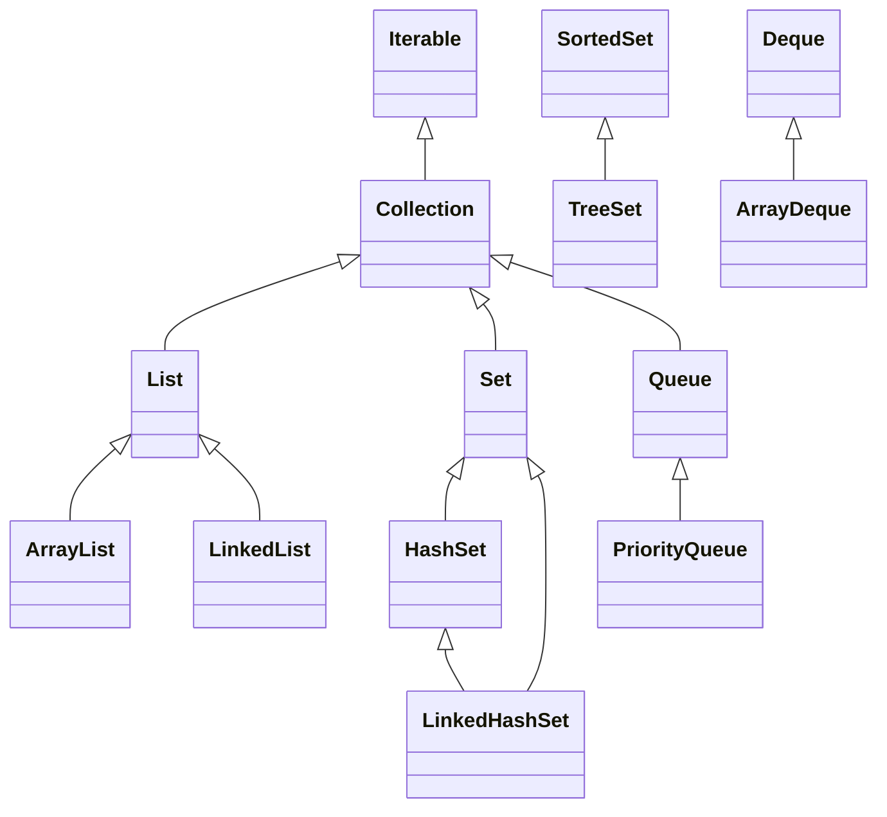

# 10. Коллекции и структуры данных

## Оглавление
- [[#Collection Framework|Collection Framework]]
- [[#Интерфейс Collection|Интерфейс Collection]]
- [[#List|List]]
- [[#Set|Set]]
- [[#Queue и Deque|Queue и Deque]]
- [[#Map|Map]]
- [[#Итераторы|Итераторы]]
- [[#Сортировка|Сортировка]]
- [[#Класс Collections|Класс Collections]]
- [[#Неизменяемые коллекции|Неизменяемые коллекции]]
- [[#Контракт equals/hashCode в коллекциях|Контракт equals/hashCode в коллекциях]]
- [[#Выбор подходящей коллекции|Выбор подходящей коллекции]]
- [[#Производительность коллекций|Производительность коллекций]]

## Collection Framework

Единая архитектура интерфейсов и реализаций для хранения и обработки групп объектов.



`Map` — отдельная ветвь (пары «ключ-значение»), не наследник `Collection`, но часть Framework.

## Интерфейс `Collection`

Базовый интерфейс групп элементов. Основные операции: `add`, `remove`, `contains`, `size`, `isEmpty`, `clear`, `iterator`.

```java
Collection<String> col = new ArrayList<>();
col.add("a");
col.contains("a");   // true
col.size();          // 1
```

## List

Упорядоченная коллекция с индексами; допускает дубликаты и `null`.

### ArrayList

Список на основе динамического массива. Быстрый доступ по индексу, медленная вставка/удаление в середине.

```java
List<String> list = new ArrayList<>();
list.add("a");
list.add("b");
list.get(0);          // "a"
list.set(1, "c");     // замена
list.remove(0);
list.size();
```

### LinkedList

Двусвязный список. Быстрая вставка/удаление в начале и конце, медленный доступ по индексу.

```java
LinkedList<String> ll = new LinkedList<>();
ll.addFirst("start");
ll.addLast("end");
ll.getFirst();        // "start"
```

### Операции

```java
// индексация
list.get(i);
list.indexOf("b");     // индекс первого вхождения

// добавление
list.add("x");         // в конец
list.add(0, "y");      // по индексу

// удаление
list.remove("x");      // по объекту
list.remove(0);        // по индексу

// поиск
list.contains("a");

// итерация
for (String s : list) { ... }
list.forEach(System.out::println);
```

Выбор между `ArrayList` и `LinkedList` — см. [[#Выбор подходящей коллекции|таблицу выбора]].

## Set

Коллекция без дубликатов. Порядок зависит от реализации.

### HashSet

Хэш-таблица: O(1) для основных операций. Порядок не гарантирован.

```java
Set<String> set = new HashSet<>();
set.add("a");
set.add("a");     // дубликат не добавится
set.size();       // 1
```

### LinkedHashSet

Как `HashSet`, но сохраняет порядок вставки.

### TreeSet

Отсортированный набор (красно-чёрное дерево). Элементы должны быть сравнимы (`Comparable` или переданный `Comparator`, см. [[#Сортировка|сортировку]]).

```java
TreeSet<Integer> ts = new TreeSet<>();
ts.add(3); ts.add(1); ts.add(2);
ts.first();   // 1
ts.last();    // 3
```

## Queue и Deque

### PriorityQueue

Очередь с приоритетом: элемент с наименьшим приоритетом (по `Comparator`) извлекается первым.

```java
PriorityQueue<Integer> pq = new PriorityQueue<>();
pq.add(3); pq.add(1); pq.add(2);
pq.poll();   // 1 — наименьший
```

### ArrayDeque

Двусторонняя очередь на массиве. Основные операции:

```java
ArrayDeque<String> dq = new ArrayDeque<>();
dq.addFirst("a");
dq.addLast("b");
dq.pollFirst();   // "a"
dq.pollLast();    // "b"
```

### Использование как стек и очередь

```java
// как стек (LIFO)
ArrayDeque<String> stack = new ArrayDeque<>();
stack.push("1");
stack.push("2");
stack.pop();      // "2"

// как очередь (FIFO)
ArrayDeque<String> queue = new ArrayDeque<>();
queue.offer("1");
queue.offer("2");
queue.poll();     // "1"
```

`ArrayDeque` предпочтительнее `Stack` (устаревший) и для очередей обычно лучше `LinkedList`.

## Map

Пара «ключ-значение». Ключи уникальны.

### HashMap

Хэш-таблица: O(1) для `get`/`put`. Порядок не гарантирован.

```java
Map<String, Integer> map = new HashMap<>();
map.put("apple", 5);
map.put("banana", 3);
map.get("apple");         // 5
map.containsKey("apple"); // true
map.getOrDefault("cherry", 0); // 0
```

### LinkedHashMap

Сохраняет порядок вставки записей.

### TreeMap

Отсортированная карта по ключу.

### Hashtable

Устаревшая потокобезопасная карта. Вместо неё — `ConcurrentHashMap` (см. [[14. Многопоточность и конкурентность#Concurrent collections|concurrent collections]]).

Итерация по `Map`:

```java
for (var e : map.entrySet()) {
    System.out.println(e.getKey() + "=" + e.getValue());
}
map.forEach((k, v) -> System.out.println(k + "=" + v));
```

## Итераторы

### `Iterator`

Последовательный обход с удалением:

```java
Iterator<String> it = list.iterator();
while (it.hasNext()) {
    String s = it.next();
    if (s.equals("x")) it.remove();
}
```

Удаление через `it.remove()` безопасно; удаление через `list.remove` во время итерации — `ConcurrentModificationException`.

### `ListIterator`

Двусторонний итератор для `List`:

```java
ListIterator<String> li = list.listIterator();
li.hasNext();
li.hasPrevious();
li.add("insert");
```

### `forEach`

С Java 8 — лямбда-обход (см. [[11. Лямбда-выражения и Stream API|лямбды]]):

```java
list.forEach(System.out::println);
```

## Сортировка

### `Comparable`

Естественный порядок: класс реализует `compareTo`:

```java
record Product(String name, double price) implements Comparable<Product> {
    public int compareTo(Product o) {
        return Double.compare(this.price, o.price);
    }
}

List<Product> products = ...;
Collections.sort(products);   // по цене
```

### `Comparator`

Внешний компаратор — без изменения класса:

```java
list.sort(Comparator.comparing(Product::name));
list.sort(Comparator.comparingDouble(Product::price));
```

### Составные компараторы

```java
list.sort(Comparator.comparing(Product::price)
        .reversed()
        .thenComparing(Product::name));
```

## Класс `Collections`

Статические утилиты над коллекциями.

### Сортировка

```java
Collections.sort(list);               // по естественному порядку
Collections.sort(list, comparator);   // по компаратору
```

### Поиск

```java
int i = Collections.binarySearch(sortedList, key);
```

### Перемешивание

```java
Collections.shuffle(list);
```

### Минимум и максимум

```java
Collections.min(list);
Collections.max(list, comparator);
```

### Неизменяемые обёртки

```java
List<String> unmod = Collections.unmodifiableList(list);
// unmod.add("x");  // UnsupportedOperationException
```

## Неизменяемые коллекции

С Java 9 — фабрики неизменяемых коллекций:

### `List.of`, `Set.of`, `Map.of`

```java
List<String> list = List.of("a", "b");      // неизменяемый
Set<Integer> set = Set.of(1, 2, 3);
Map<String, Integer> map = Map.of("a", 1, "b", 2);
Map<String, Integer> map2 = Map.ofEntries(Map.entry("a", 1));
```

`null` в этих фабриках запрещён.

### `copyOf`

Неизменяемая копия существующей коллекции:

```java
List<String> copy = List.copyOf(list);
```

## Контракт `equals/hashCode` в коллекциях

`HashSet`/`HashMap` полагаются на контракт `equals`/`hashCode` (см. [[06. Наследование и полиморфизм#Контракт equals/hashCode|контракт]]). Нарушение приводит к дубликатам и невозможности найти элемент.

```java
record Point(int x, int y) { }   // record: equals/hashCode корректны

Set<Point> points = new HashSet<>();
points.add(new Point(1, 2));
points.contains(new Point(1, 2));   // true
```

Важно: для `TreeSet`/`TreeMap` значение имеет `compareTo`/`Comparator`, а не `equals`.

## Выбор подходящей коллекции

| Задача | Коллекция |
| --- | --- |
| Динамический список с доступом по индексу | `ArrayList` |
| Частая вставка/удаление в начале/конце | `LinkedList` / `ArrayDeque` |
| Уникальные элементы, порядок не важен | `HashSet` |
| Уникальные элементы + порядок вставки | `LinkedHashSet` |
| Уникальные отсортированные элементы | `TreeSet` |
| Очередь FIFO | `ArrayDeque` |
| Очередь с приоритетом | `PriorityQueue` |
| Стек LIFO | `ArrayDeque` |
| Пары ключ-значение | `HashMap` |
| Пары + порядок вставки | `LinkedHashMap` |
| Пары отсортированные по ключу | `TreeMap` |
| Неизменяемая коллекция фиксированного размера | `List.of` / `Set.of` / `Map.of` |
| Многопоточный доступ | `ConcurrentHashMap` и др. (см. [[14. Многопоточность и конкурентность#Concurrent collections|concurrent]]) |

## Производительность коллекций

Сложность основных операций (O-нотация, средний случай):

| Коллекция | Добавление | Поиск | Удаление | Примечание |
| --- | --- | --- | --- | --- |
| `ArrayList` | O(1) в конце, O(n) в середине | O(1) по индексу, O(n) по значению | O(n) | массив |
| `LinkedList` | O(1) в начале/конце | O(n) | O(1) по ссылке | двусвязный список |
| `HashSet` | O(1) | O(1) | O(1) | хэш-таблица |
| `TreeSet` | O(log n) | O(log n) | O(log n) | дерево |
| `HashMap` | O(1) | O(1) | O(1) | хэш-таблица |
| `TreeMap` | O(log n) | O(log n) | O(log n) | дерево |
| `PriorityQueue` | O(log n) | O(1) peek | O(log n) poll | куча |

Итерация по `HashSet`/`HashMap` быстрее `TreeSet`/`TreeMap`, но порядок не определён. Для больших коллекций критично корректное `hashCode` (см. [[#Контракт equals/hashCode в коллекциях|контракт]]).
