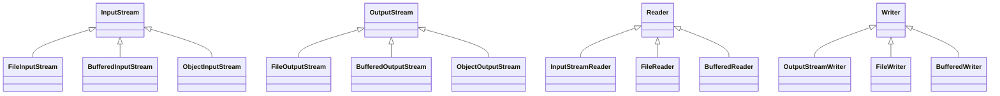

# 12. Ввод-вывод, файлы и сериализация

## Оглавление
- [[#Концепция потоков ввода-вывода|Концепция потоков ввода-вывода]]
- [[#Байтовые потоки|Байтовые потоки]]
- [[#Символьные потоки|Символьные потоки]]
- [[#Буферизация|Буферизация]]
- [[#PrintWriter|PrintWriter]]
- [[#Scanner|Scanner]]
- [[#Консоль: класс Console|Консоль: класс Console]]
- [[#NIO.2: Path, Paths, Files|NIO.2: Path, Paths, Files]]
- [[#Работа с файлами NIO.2|Работа с файлами NIO.2]]
- [[#Работа с каталогами|Работа с каталогами]]
- [[#Обход файлового дерева|Обход файлового дерева]]
- [[#Кодировки|Кодировки]]
- [[#Сериализация объектов|Сериализация объектов]]
- [[#Ограничения стандартной сериализации|Ограничения стандартной сериализации]]
- [[#FileChannel и MappedByteBuffer|FileChannel и MappedByteBuffer]]
- [[#AsynchronousFileChannel|AsynchronousFileChannel]]
- [[#Сравнение подходов I/O|Сравнение подходов I/O]]

## Концепция потоков ввода-вывода

Поток (stream) — абстрактный канал передачи данных. Иерархия классического I/O (`java.io`): байтовые потоки и символьные.

| Семейство | Корни | Чем оперирует | Для чего |
| --- | --- | --- | --- |
| Байтовые | `InputStream` / `OutputStream` | байты | бинарные данные, файлы, сеть |
| Символьные | `Reader` / `Writer` | символы (с учётом кодировки) | текст |



Классическое I/O построено на **декораторах**: функциональность накладывается обёртками вокруг базового потока (например, `new BufferedReader(new FileReader(...))`).

Все ресурсы ввода-вывода реализуют `AutoCloseable` — закрывать через try-with-resources (см. [[08. Исключения и обработка ошибок#Try-with-resources|try-with-resources]]).

### `InputStreamReader`/`OutputStreamWriter`

Мост между байтовыми и символьными потоками с явной кодировкой:

```java
try (var r = new BufferedReader(
        new InputStreamReader(new FileInputStream("data.txt"), StandardCharsets.UTF_8))) {
    String line = r.readLine();
}
```

`FileReader`/`FileWriter` — частный случай без контроля кодировки (устаревающий подход для текста).

## Байтовые потоки

Работают с байтами — подходят для бинарных данных.

### `InputStream`, `OutputStream`

```java
InputStream in = new FileInputStream("a.bin");
int b;
while ((b = in.read()) != -1) {   // -1 — конец потока
    process(b);
}
in.close();

OutputStream out = new FileOutputStream("a.bin");
out.write(65);   // один байт
out.close();
```

### `FileInputStream`, `FileOutputStream`

Байтовые потоки для файлов.

```java
try (var in = new FileInputStream("in.bin");
     var out = new FileOutputStream("out.bin")) {
    in.transferTo(out);   // копирование
}
```

### Типизированные байтовые потоки

`DataInputStream`/`DataOutputStream` — чтение/запись примитивов в машинно-независимом формате:

```java
try (var out = new DataOutputStream(new FileOutputStream("data.bin"))) {
    out.writeInt(42);
    out.writeUTF("текст");       // длина + UTF-8
    out.writeDouble(3.14);
}

try (var in = new DataInputStream(new FileInputStream("data.bin"))) {
    int i = in.readInt();
    String s = in.readUTF();
    double d = in.readDouble();
}
```

Порядок чтения обязан совпадать с порядком записи.

### `RandomAccessFile`

Произвольный доступ к файлу по позиции:

```java
try (RandomAccessFile raf = new RandomAccessFile("data.bin", "rw")) {
    raf.seek(8);              // перейти к байту 8
    long value = raf.readLong();
    raf.seek(0);
    raf.writeInt(1);          // запись с начала
}
```

Режимы: `r` (чтение), `rw` (чтение+запись), `rws`/`rwd` (синхронная запись). Полезно для больших файлов, где нужен доступ «в точку».

## Символьные потоки

Работают с символами и кодировкой.

### `Reader`, `Writer`

```java
Reader r = new FileReader("text.txt");
int ch;
while ((ch = r.read()) != -1) { ... }
r.close();

Writer w = new FileWriter("text.txt");
w.write("Привет");
w.close();
```

### `FileReader`, `FileWriter`

Символьные потоки для файлов. `FileReader` использует кодировку по умолчанию — для контроля кодировки лучше NIO.2 (см. [[#Кодировки|кодировки]]).

## Буферизация

Буферизованные потоки уменьшают число системных вызовов и ускоряют работу.

### `BufferedInputStream`, `BufferedOutputStream`

```java
try (var in = new BufferedInputStream(new FileInputStream("a.bin"))) {
    int b;
    while ((b = in.read()) != -1) { ... }
}
```

### `BufferedReader`, `BufferedWriter`

Добавляют построчное чтение:

```java
try (var br = new BufferedReader(new FileReader("data.txt"))) {
    String line;
    while ((line = br.readLine()) != null) {
        System.out.println(line);
    }
}
```

```java
try (var bw = new BufferedWriter(new FileWriter("out.txt"))) {
    bw.write("первая строка");
    bw.newLine();
}
```

Не забывать `flush()`/закрытие — иначе данные могут остаться в буфере.

## PrintWriter

Удобный вывод с `print`/`printf`. Выводит в `Writer` (или `OutputStream`) любой тип, сам обрабатывает примитивы и `null`, умеет форматировать как `System.out`:

```java
try (var pw = new PrintWriter(new FileWriter("log.txt"))) {
    pw.println("info: " + message);
    pw.printf("code=%d%n", 42);
}
```

### Принцип работы

- `PrintWriter` не бросает исключений при выводе — ошибки накапливаются и проверяются через `checkError()`.
- Автоматическая подстановка разделителя строк платформы через `println` и `%n` в `printf`.
- Методы не синхронизированы; потоки ввода-вывода в целом не потокобезопасны — разделяемый `PrintWriter` нужно защищать синхронизацией.

### Конструкторы и источники вывода

| Конструктор | Куда выводит |
| --- | --- |
| `PrintWriter(Writer out)` | в произвольный `Writer` |
| `PrintWriter(OutputStream out)` | в байтовый поток (конвертирует сам, без указания кодировки — не рекомендуется для текста) |
| `PrintWriter(File file)` | в файл (символьный) |
| `PrintWriter(String fileName)` | в файл по имени |
| `PrintWriter(Writer out, boolean autoFlush)` | автосброс при `println`/`printf` |

### Форматирование: `printf`

Спецификаторы `%d`, `%f`, `%.2f`, `%s`, `%x`, флаги и ширина — полный синтаксис см. [[13. Дата, время, числа и полезные API#Форматирование чисел (Formatter)|Formatter]]. `%n` — перенос строки, независимый от платформы:

```java
try (var pw = new PrintWriter(new FileWriter("log.txt"))) {
    pw.printf("%-10s %5d %n", "item", 42);   // ширина, выравнивание влево
    pw.printf(Locale.US, "%.2f%n", 3.14159); // локаль — десятичная точка
}
```

### Проверка ошибок: `checkError()`

Печать не бросает `IOException` — ошибочное состояние нужно проверять явно:

```java
PrintWriter pw = new PrintWriter(new FileWriter("log.txt"));
pw.println("...");
if (pw.checkError()) {
    // что-то пошло не так при записи
}
```

Полезно перед закрытием, когда важен факт успешной записи (логи, отчёты). `close()` сам сбрасывает буфер и фиксирует ошибку в состоянии.

### `print` vs `write`

- `print(String)`/`println` — «дружелюбный» вывод: `null` → `"null"`, примитивы → их строковое представление.
- `write(String)` — низкоуровневый вывод без преобразований, может выбросить `IOException`.

### `PrintStream` и `System.out`

Консольный вывод `System.out` — это `PrintStream` (байтовый поток с символьной семантикой), а не `PrintWriter`. Оба класса дают почти одинаковый API (`print`/`println`/`printf`/`checkError`), различия:

| | `PrintStream` | `PrintWriter` |
| --- | --- | --- |
| Наследник | `FilterOutputStream` (байтовый) | `Writer` (символьный) |
| Потокобезопасность | да (методы синхронизированы) | нет |
| Кодировка | задаётся при создании; `System.out` — по умолчанию | есть конструкторы с `Charset` |
| Когда использовать | `System.out`, `System.err`, консоль | вывод текста в файл/поток с контролем кодировки |

```java
System.out.printf("value = %d%n", 42);   // PrintStream
PrintWriter pw = new PrintWriter(Files.newBufferedWriter(
        Path.of("log.txt"), StandardCharsets.UTF_8));
```

### Рекомендации

- Для текста с указанием кодировки — `new PrintWriter(Files.newBufferedWriter(Path.of("f.txt"), StandardCharsets.UTF_8))`.
- `PrintWriter` не требует обязательного закрытия в отличие от потоков, но с try-with-resources (см. [[08. Исключения и обработка ошибок#Try-with-resources|try-with-resources]]) он закрывается надёжно.

## Scanner

Разбор ввода (с консоли, файла, строки) по токенам:

```java
Scanner sc = new Scanner(System.in);
System.out.print("Введите число: ");
int n = sc.nextInt();

try (var file = new Scanner(Path.of("data.txt"))) {
    while (file.hasNextInt()) {
        int v = file.nextInt();
        ...
    }
}
```

Методы: `nextInt`, `nextDouble`, `next`, `nextLine`, `hasNext...`. `nextLine` после `nextInt` требует осторожности с остатком строки.

### Принцип работы

`Scanner` разбивает ввод на токены регулярными выражениями. По умолчанию разделитель — пробельные символы; считывает из источника лениво, по мере вызова методов `next...`. Это «обратная сторона» `PrintWriter`: он читает/разбирает, тот — форматирует.

### Источники ввода

```java
new Scanner(System.in);                    // консоль
new Scanner(Path.of("data.txt"));          // файл (кодировка по умолчанию)
new Scanner(new File("data.txt"));         // файл (классический File)
new Scanner("42 текст");                   // строка
new Scanner(new FileInputStream("f.bin")); // байтовый поток
new Scanner(reader);                       // произвольный Reader
```

С кодировкой:

```java
try (var sc = new Scanner(Path.of("data.txt"), StandardCharsets.UTF_8)) { ... }
```

`Scanner` реализует `AutoCloseable` — закрывать через try-with-resources, иначе файл останется открытым.

### Методы разбора

| Метод | Тип результата | Что читает |
| --- | --- | --- |
| `nextInt()` / `nextLong()` / `nextShort()` / `nextByte()` | целые | целочисленный токен |
| `nextFloat()` / `nextDouble()` | дробные | число с плавающей точкой |
| `nextBoolean()` | `boolean` | `true`/`false` |
| `next()` | `String` | следующий токен (до разделителя) |
| `nextLine()` | `String` | всю строку целиком |
| `nextBigDecimal()` / `nextBigInteger()` | `BigDecimal` / `BigInteger` | произвольной точности |

Парные проверки-предикаты `hasNextInt()`, `hasNextDouble()`, `hasNext()`, `hasNextLine()` и т.д. — безопасная проверка наличия токена нужного типа перед чтением.

### Токены и разделители

```java
try (var sc = new Scanner("10 20 30")) {
    sc.useDelimiter("\\s+");          // разделитель — по умолчанию, можно сменить
    while (sc.hasNextInt()) {
        System.out.println(sc.nextInt());   // 10, 20, 30
    }
}
```

Примеры разделителей: `","` (CSV), `";"`, `"\\s*,\\s*"` (запятая с любым числом пробелов вокруг). Метод `useDelimiter(String)` или `useDelimiter(Pattern)`.

### Проблема `nextLine` после `nextInt`

Методы `nextInt`/`nextDouble` читают только число, а перевод строки остаётся в буфере. Следующий `nextLine()` вернёт пустую строку:

```java
Scanner sc = new Scanner(System.in);
int n = sc.nextInt();        // пользователь вводит "42\n" — остаётся '\n'
String s = sc.nextLine();    // вернёт "" — остаток строки!
```

Исправление — «съесть» остаток строки после числового метода:

```java
int n = sc.nextInt();
sc.nextLine();               // проглотить перевод строки
String s = sc.nextLine();    // теперь корректно
```

Или — обратный порядок: читать строку `nextLine()`, затем парсить её (см. [[13. Дата, время, числа и полезные API#Парсинг чисел|парсинг чисел]]).

### Числа с дробной частью и локаль

`nextDouble` ожидает формат, зависящий от локали по умолчанию: в русской локали десятичный разделитель — запятая. Если данные записаны с точкой, задать локаль явно:

```java
try (var sc = new Scanner(reader).useLocale(Locale.US)) {
    double d = sc.nextDouble();   // читает "3.14"
}
```

### Полный пример: чтение файла с разбором

```java
Path p = Path.of("data.txt");
try (var sc = new Scanner(p, StandardCharsets.UTF_8)) {
    while (sc.hasNext()) {
        String word = sc.next();       // слово за словом
        if (sc.hasNextInt()) {
            int number = sc.nextInt(); // встретилось число
        }
    }
}
```

### Когда использовать Scanner, а когда BufferedReader

| Задача | Инструмент |
| --- | --- |
| Ввод с консоли, разбор чисел | `Scanner` |
| Построчное чтение с форматированием | `BufferedReader.readLine` (см. [[#BufferedReader, BufferedWriter|буферизация]]) |
| Многострочный вывод, printf | `PrintWriter` / `Formatter` |

`Scanner` проще и удобнее для разбора, но работает медленнее и в цикле порождает больше временных объектов, чем `BufferedReader`.

### Консоль: класс `Console`

Для ввода с консоли есть специализированный `System.console()` (`java.io.Console`). Внимание: возвращает `null`, если процесс запущен без терминала (IDE, перенаправление ввода) — нужна проверка:

```java
Console console = System.console();
if (console == null) {
    // консоль недоступна — работать через Scanner
    return;
}
String line = console.readLine("Имя: ");       // подсказка + чтение строки
char[] pass = console.readPassword("Пароль: "); // без эха ввода
```

`readPassword` не показывает введённое и возвращает `char[]`, а не `String`, — чтобы после ввода очистить память. Форматированный вывод — `console.printf(...)`.

## NIO.2: Path, Paths, Files

Современный API работы с файлами (`java.nio.file`).

### `Path`

Путь к файлу или каталогу:

```java
Path p = Path.of("data", "logs", "app.log");   // data/logs/app.log
Path abs = Path.of("C:", "Users", "me", "file.txt");
```

Методы работы с путём:

```java
p.getFileName();    // app.log
p.getParent();      // data/logs
p.getRoot();        // null (относительный) или "C:\"
p.getFileSystem();  // файловая система
p.resolve("x.log"); // data/logs/app.log/x.log — склейка путей
p.normalize();      // убирает . и ..
Path abs = p.toAbsolutePath();   // абсолютный
p.relativize(other);             // относительный путь между двумя
```

### `Paths`

Устаревший фабричный класс (`Paths.get`); современный способ — `Path.of`.

### `Files`

Статические операции с файлами.

### Атрибуты файлов

```java
Files.size(p);                       // размер в байтах
Files.getLastModifiedTime(p);        // время модификации
Files.getAttribute(p, "size");
Files.isReadable(p);
Files.isWritable(p);
Files.isExecutable(p);
Files.isHidden(p);
```

## Работа с файлами NIO.2

### Создание, чтение, запись

```java
Path p = Path.of("hello.txt");
Files.createFile(p);                       // создать пустой
Files.writeString(p, "Привет, мир!");      // записать строку (Java 11+)
Files.writeString(p, "Дополнение", StandardOpenOption.APPEND);

String content = Files.readString(p);       // прочитать целиком (Java 11+)
List<String> lines = Files.readAllLines(p); // построчно
Files.lines(p).forEach(System.out::println); // ленивый stream
```

Варианты записи байтов и строк с опциями:

```java
Files.write(p, "текст".getBytes(StandardCharsets.UTF_8));       // байты
Files.write(p, List.of("строка1", "строка2"));                  // список строк
Files.write(p, data, StandardOpenOption.CREATE, StandardOpenOption.APPEND);
```

Чтение из потока и низкоуровневые потоки:

```java
// новый InputStream/OutputStream для файла (буферизованные)
try (var in = Files.newInputStream(p);
     var out = Files.newOutputStream(p2)) {
    in.transferTo(out);
}

// буферизованные Reader/Writer
try (var br = Files.newBufferedReader(p);
     var bw = Files.newBufferedWriter(p2)) { ... }
```

### Копирование, перемещение, удаление

```java
Files.copy(src, dst, StandardCopyOption.REPLACE_EXISTING);
Files.move(src, dst, StandardCopyOption.REPLACE_EXISTING);
Files.delete(p);                // бросает, если нет
Files.deleteIfExists(p);        // безопасно
Files.mismatch(a, b);           // -1, если файлы идентичны (Java 12+)
```

Копирование/перемещение между файловыми системами работает, но с предостережениями; для копирования между разными ФС лучше поток (см. [[#Байтовые потоки|байтовые потоки]]).

## Работа с каталогами

```java
Files.createDirectory(Path.of("newdir"));
Files.createDirectories(Path.of("a/b/c"));   // создаёт и промежуточные

// список содержимого
try (var stream = Files.list(Path.of("."))) {
    stream.forEach(System.out::println);
}

// проверка
Files.exists(p);
Files.isDirectory(p);
Files.isRegularFile(p);
```

Фильтрация по имени:

```java
try (var stream = Files.list(dir)) {
    stream.filter(Files::isRegularFile)
          .filter(f -> f.toString().endsWith(".txt"))
          .forEach(System.out::println);
}
```

## Обход файлового дерева

### `Files.walk`

Рекурсивный обход всего дерева (ленивый stream):

```java
try (var paths = Files.walk(Path.of("src"))) {
    paths.filter(Files::isRegularFile)
         .filter(p -> p.toString().endsWith(".java"))
         .forEach(System.out::println);
}
```

С ограничением глубины: `Files.walk(dir, depth)`.

### `Files.walkFileTree`

Управляемый обход с колбэками на вход/выход из каталога:

```java
Files.walkFileTree(Path.of("src"), new SimpleFileVisitor<>() {
    @Override
    public FileVisitResult preVisitDirectory(Path dir, BasicFileAttributes attrs) {
        System.out.println("каталог: " + dir);
        return FileVisitResult.CONTINUE;
    }
    @Override
    public FileVisitResult visitFile(Path file, BasicFileAttributes attrs) {
        System.out.println("файл: " + file);
        return FileVisitResult.CONTINUE;
    }
});
```

`FileVisitResult` позволяет прерывать обход (`TERMINATE`) и пропускать поддеревья (`SKIP_SUBTREE`).

### `Files.find`

`walk` с фильтром по атрибутам:

```java
try (var paths = Files.find(dir, Integer.MAX_VALUE,
        (p, attrs) -> attrs.isRegularFile() && p.toString().endsWith(".log"))) {
    paths.forEach(System.out::println);
}
```

## Кодировки

### UTF-8

С Java 18 UTF-8 — кодировка по умолчанию для многих операций. Явно указывать желательно всегда.

### `Charset`

```java
Files.writeString(p, "текст", Charset.forName("UTF-8"));
Files.readString(p, StandardCharsets.UTF_8);
```

При чтении в неправильной кодировке текст повреждается (например, UTF-8 как windows-1251 даёт «кракозябры»).

## Сериализация объектов

Превращение объекта в поток байтов и обратно.

### `Serializable`

Маркерный интерфейс — объект можно сериализовать:

```java
record User(String name, int age) implements Serializable { }
```

### `ObjectInputStream`, `ObjectOutputStream`

```java
try (var oos = new ObjectOutputStream(new FileOutputStream("user.bin"))) {
    oos.writeObject(new User("Аня", 30));
}

try (var ois = new ObjectInputStream(new FileInputStream("user.bin"))) {
    User u = (User) ois.readObject();
}
```

### `serialVersionUID`

Версия класса для проверки совместимости при десериализации:

```java
class User implements Serializable {
    private static final long serialVersionUID = 1L;
    ...
}
```

Без него JVM вычисляет UID автоматически — изменение класса ломает совместимость. Явный UID обязателен при изменении классов.

### `transient`

Поля, не подлежащие сериализации (пароли, временные данные):

```java
class Session implements Serializable {
    private String login;
    private transient String password;   // не сохраняется
}
```

### `Externalizable`

Интерфейс ручного управления сериализацией (в отличие от `Serializable`) — полный контроль над форматом через `writeExternal`/`readExternal`:

```java
class Point implements Externalizable {
    private int x, y;
    public Point() { }                       // обязателен public-конструктор без параметров

    public void writeExternal(ObjectOutput out) throws IOException {
        out.writeInt(x);
        out.writeInt(y);
    }
    public void readExternal(ObjectInput in) throws IOException {
        x = in.readInt();
        y = in.readInt();
    }
}
```

`Externalizable` быстрее и компактнее для сложных объектов, но требует ручной поддержки версий.

### Полный пример сериализации

```java
record User(String name, int age) implements Serializable {
    private static final long serialVersionUID = 1L;
}

Path file = Path.of("user.bin");
try (var oos = new ObjectOutputStream(new FileOutputStream(file.toFile()))) {
    oos.writeObject(new User("Аня", 30));
}
try (var ois = new ObjectInputStream(new FileInputStream(file.toFile()))) {
    User u = (User) ois.readObject();
}
```

## Ограничения стандартной сериализации

- Медленна, хрупка при изменении классов.
- Небезопасна: байты можно подделать (риски при десериализации непроверенных данных).
- Сериализуются только `Serializable` объекты; ссылки на несериализуемые — `NotSerializableException`.
- Статические поля и `transient` не сохраняются.
- Для современных приложений предпочтительны текстовые форматы — JSON, XML (через библиотеки), а не стандартная Java-сериализация.

## FileChannel и MappedByteBuffer

`FileChannel` — низкоуровневый канал для файловых операций (NIO, `java.nio.channels`). Быстрее `InputStream`/`OutputStream` при больших объёмах данных. `MappedByteBuffer` — отображение файла в память:

```java
// FileChannel: чтение/запись через буфер
try (var channel = FileChannel.open(Path.of("data.bin"), StandardOpenOption.READ)) {
    ByteBuffer buf = ByteBuffer.allocate(1024);
    int bytesRead = channel.read(buf);   // в буфер
    buf.flip();                          // переключение на чтение
    while (buf.hasRemaining()) {
        System.out.print((char) buf.get());
    }
}

// Memory-mapped файл: не выделяет память явно
try (var channel = FileChannel.open(Path.of("large.bin"), StandardOpenOption.READ)) {
    MappedByteBuffer mapped = channel.map(
            FileChannel.MapMode.READ_ONLY, 0, channel.size());
    while (mapped.hasRemaining()) {
        byte b = mapped.get();
    }
}
```

Memory-mapped I/O особенно эффективен для больших файлов (сотни МБ и выше) — ОС управляет подкачкой страниц, Java не копирует данные в user space.

## AsynchronousFileChannel

Асинхронное (неблокирующее) чтение/запись файла (Java 7+). Не блокирует поток при ожидании I/O — результат через `Future` или `CompletionHandler`:

```java
// через Future
try (var ch = AsynchronousFileChannel.open(Path.of("data.txt"), StandardOpenOption.READ)) {
    ByteBuffer buf = ByteBuffer.allocate(1024);
    Future<Integer> result = ch.read(buf, 0);   // не блокирует
    int bytesRead = result.get();               // блокирует при запросе результата
    System.out.println("Прочитано: " + bytesRead);
}

// через CompletionHandler
ch.read(buf, 0, null, new CompletionHandler<>() {
    @Override
    public void completed(Integer result, Object attachment) {
        System.out.println("Чтение завершено: " + result);
    }
    @Override
    public void failed(Throwable e, Object attachment) {
        System.err.println("Ошибка: " + e);
    }
});
```

Подходит для высоконагруженных систем с массовыми файловыми операциями (веб-серверы, обработка логов в реальном времени).

## Сравнение подходов I/O

| Подход | Пакет | Модель | Блокировка | Скорость | Когда |
| --- | --- | --- | --- | --- | --- |
| Stream I/O | `java.io` | синхронная, потоковая | блокирующий | средняя | малые/средние файлы, текст |
| NIO Channels | `java.nio.channels` | каналы + буферы | блокирующий | выше | большие бинарные файлы |
| Memory-mapped | `java.nio` | отображение в память | блокирующий | наивысшая | очень большие файлы (ГБ) |
| Async I/O | `java.nio.channels` | асинхронная с callback | неблокирующий | высокая | массовый I/O, высокие нагрузки |
| NIO.2 Files | `java.nio.file` | удобные статические методы | блокирующий | средняя | 90% задач: чтение/запись/копирование |
