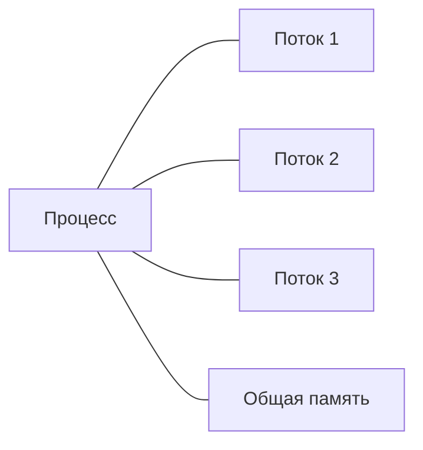
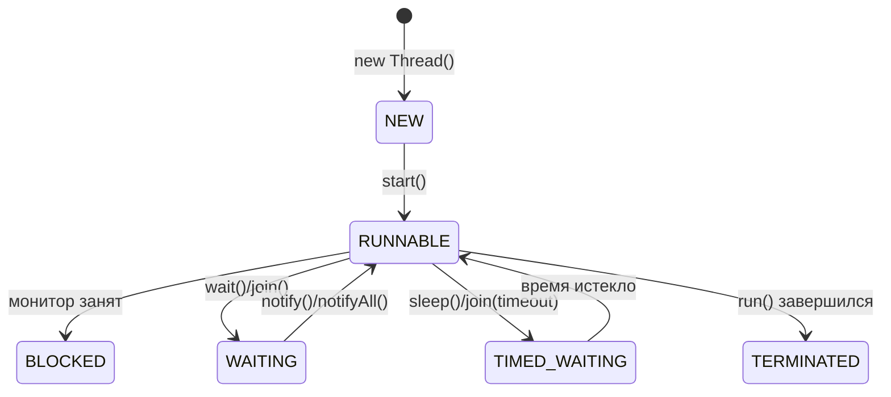
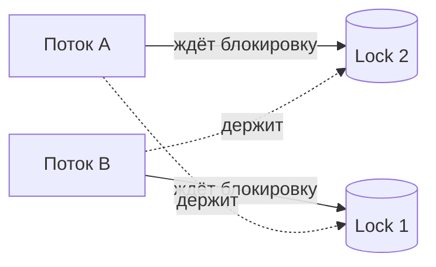

# 14. Многопоточность и конкурентность

## Оглавление
- [[#Процессы и потоки|Процессы и потоки]]
- [[#Создание потоков|Создание потоков]]
- [[#Жизненный цикл потока|Жизненный цикл потока]]
- [[#start против run|start против run]]
- [[#sleep и join|sleep и join]]
- [[#Прерывание потоков|Прерывание потоков]]
- [[#Race condition|Race condition]]
- [[#Синхронизация|Синхронизация]]
- [[#Visibility и Java Memory Model|Visibility и Java Memory Model]]
- [[#volatile|volatile]]
- [[#Atomic classes|Atomic classes]]
- [[#Locks|Locks]]
- [[#Executors|Executors]]
- [[#Callable и Future|Callable и Future]]
- [[#CompletableFuture|CompletableFuture]]
- [[#Concurrent collections|Concurrent collections]]
- [[#Deadlock, Livelock, Starvation|Deadlock, Livelock, Starvation]]
- [[#Virtual threads|Virtual threads]]
- [[#Structured Concurrency|Structured Concurrency]]

## Процессы и потоки

**Процесс** — изолированный экземпляр программы со своей памятью. **Поток** — единица выполнения внутри процесса; потоки делят память процесса, поэтому могут общаться через общие объекты.



Многопоточность позволяет использовать несколько ядер CPU и не блокировать программу при ожидании ввода-вывода (см. [[12. Ввод-вывод, файлы и сериализация|ввод-вывод]]).

## Создание потоков

### `Thread`

```java
Thread t = new Thread(() -> {
    System.out.println("В потоке: " + Thread.currentThread().getName());
});
t.start();
```

### `Runnable`

Функциональный интерфейс задачи (см. [[11. Лямбда-выражения и Stream API#Функциональные интерфейсы|функциональные интерфейсы]]):

```java
Runnable task = () -> { ... };
Thread t = new Thread(task);
t.start();
```

### Лямбда как Runnable

Лямбда сокращает создание потока:

```java
new Thread(() -> System.out.println("работаю")).start();
```

### Имя, приоритет, демон-потоки

```java
Thread t = new Thread(task);
t.setName("worker-1");            // имя для отладки
t.setPriority(Thread.MAX_PRIORITY); // 1..10, подсказка планировщику (не гарантия)
t.setDaemon(true);                // демон: не держит JVM при завершении main
t.start();

Thread.currentThread().getName(); // имя текущего потока
Thread.currentThread().isDaemon();
```

**Демон-потоки** не блокируют завершение JVM: когда заканчивается последний недемонический поток, JVM завершается, обрывая демонов. Для фоновых задач — `daemon`; для критичной работы — обычные.

### `Thread.ofPlatform` / `ofVirtual`

С Java 21:

```java
Thread t = Thread.ofPlatform().name("worker").start(task);
// или
Thread vt = Thread.ofVirtual().name("vthread").start(task);
```

## Жизненный цикл потока



Состояния enum `Thread.State`: `NEW`, `RUNNABLE`, `BLOCKED`, `WAITING`, `TIMED_WAITING`, `TERMINATED`.

## `start` против `run`

`start()` создаёт новый поток и выполняет в нём `run()`. Прямой вызов `run()` выполняется **в текущем** потоке — параллелизма нет.

```java
Thread t = new Thread(task);
t.start();   // новый поток
// t.run();  // выполнится в текущем потоке — ошибка
```

## `sleep` и `join`

`sleep` — пауза текущего потока; `join` — ожидание завершения другого потока.

```java
Thread.sleep(1000);   // пауза 1 с (бросает InterruptedException)

Thread t = new Thread(task);
t.start();
t.join();             // ждём завершения t
```

`join(millis)` — ожидание с таймаутом.

## Прерывание потоков

### `interrupt`

Кооперативный механизм остановки: поток сам проверяет флаг прерывания.

```java
Thread t = new Thread(() -> {
    while (!Thread.currentThread().isInterrupted()) {
        // работа
    }
});
t.start();
t.interrupt();   // запрос прерывания
```

### `InterruptedException`

Бросается блокирующими методами (`sleep`, `wait`, `join`). Корректная реакция — восстановить флаг прерывания:

```java
try {
    Thread.sleep(1000);
} catch (InterruptedException e) {
    Thread.currentThread().interrupt();   // восстановить флаг
    // завершить работу потока
}
```

Проглатывание `InterruptedException` — антипаттерн.

## Race condition

Гонка данных: несколько потоков изменяют общее состояние без синхронизации — результат непредсказуем.

```java
class Counter {
    private int count;
    void increment() { count++; }   // не атомарно!
}
```

`count++` — три шага (читать, прибавить, записать). Без синхронизации значение теряется.

## Синхронизация

### `synchronized`-методы

Блокировка монитора объекта на время выполнения метода:

```java
class Counter {
    private int count;
    synchronized void increment() { count++; }
}
```

### `synchronized`-блоки

Точная блокировка фрагмента:

```java
synchronized (lock) {
    // критическая секция
}
```

### Мониторы

Каждый объект Java имеет монитор — неявную блокировку. `synchronized` использует его. `wait`/`notify`/`notifyAll` работают с монитором:

```java
synchronized (shared) {
    while (!ready) shared.wait();    // отпустить монитор и ждать
    // ...
    shared.notifyAll();              // разбудить ожидающих
}
```

`wait()`/`notify()` вызываются только внутри `synchronized` (иначе `IllegalMonitorStateException`). `wait()` отпускает монитор и переводит поток в `WAITING`; после пробуждения поток снова захватывает монитор.

### Выбор механизма синхронизации

| Механизм | Атомарность | Видимость | Когда |
| --- | --- | --- | --- |
| `volatile` | нет (только чтение/запись) | да | флаги, готовность данных |
| `synchronized` | да (критическая секция) | да | короткие секции, простота |
| Atomic-классы | да (отдельная операция) | да | счётчики, инкременты |
| `Lock` | да (явное управление) | да | таймауты, прерываемость, условия |

## Visibility и Java Memory Model

### Java Memory Model

Определяет, когда запись в одном потоке видна в другом. Потоки могут кэшировать значения; без синхронизации запись может не дойти.

### Happens-before

Отношение «произошло-до»: если действие A happens-before B, результат A виден в B. Устанавливается `synchronized`, `volatile`, `final`, `start`/`join` и др.

Основные источники happens-before:

- **`volatile`**: запись happens-before последующее чтение того же поля.
- **`synchronized`**: выход из блока happens-before вход в блок на том же мониторе.
- **`start()`**: действия до `start()` happens-before действий нового потока.
- **`join()`**: действия завершённого потока happens-before `join()` в вызывающем.
- **`final`-поля**: безопасная публикация объекта с корректно инициализированными `final`-полями.

```java
volatile boolean ready = false;
int value = 0;

// поток A
value = 42;        // 1
ready = true;      // 2 — volatile-запись

// поток B
if (ready) {       // 3 — volatile-чтение: увидит value == 42
    use(value);    // гарантировано 42, благодаря happens-before
}
```

## `volatile`

Гарантирует видимость поля между потоками, но не атомарность составных операций.

```java
class Flag {
    volatile boolean running = true;   // запись видна другим потокам
}
```

`volatile` подходит для флагов; для счётчиков — атомарные классы (см. [[#Atomic classes|atomic]]).

## Atomic classes

Атомарные операции без блокировок.

### `AtomicInteger`, `AtomicLong`

```java
AtomicInteger count = new AtomicInteger();
count.incrementAndGet();
count.getAndAdd(5);
count.compareAndSet(10, 20);
```

### CAS

Сравнение-и-обмен (compare-and-swap) — аппаратная атомарная операция, лежащая в основе атомарных классов и оптимистичной конкурентности.

### `AtomicReference` и производные

```java
AtomicReference<String> ref = new AtomicReference<>("a");
ref.set("b");
ref.compareAndSet("b", "c");
ref.updateAndGet(s -> s + "!");   // атомарное обновление по функции
```

### `LongAdder`/`LongAccumulator`

Для высококонкурентных счётчиков — быстрее `AtomicLong` при многих потоках (разбиение на клетки):

```java
LongAdder counter = new LongAdder();
counter.increment();
counter.increment();
counter.sum();   // 2
```

## Locks

Явные блокировки (`java.util.concurrent.locks`) — гибче `synchronized`.

### `Lock`, `ReentrantLock`

```java
Lock lock = new ReentrantLock();
lock.lock();
try {
    // критическая секция
} finally {
    lock.unlock();   // обязательно в finally
}
```

Преимущества: таймаут (`tryLock`), прерываемость, несколько условий.

`tryLock` с таймаутом — защита от deadlock (см. [[#Deadlock, Livelock, Starvation|deadlock]]):

```java
if (lock.tryLock(2, TimeUnit.SECONDS)) {
    try {
        // работа
    } finally {
        lock.unlock();
    }
} else {
    // не удалось захватить вовремя
}
```

### Условия (`Condition`)

Аналог `wait`/`notify` для `Lock` — несколько независимых очередей ожидания:

```java
Lock lock = new ReentrantLock();
Condition notEmpty = lock.newCondition();
Condition notFull = lock.newCondition();

lock.lock();
try {
    while (queue.isEmpty()) notEmpty.await();   // ждать
    // ...
    notFull.signalAll();                        // разбудить
} finally {
    lock.unlock();
}
```

### `ReadWriteLock`

Разделение блокировок чтения и записи:

```java
ReadWriteLock rw = new ReentrantReadWriteLock();
Lock read = rw.readLock();
Lock write = rw.writeLock();
```

Много читателей могут работать параллельно; запись — эксклюзивно.

## Executors

Фреймворк пулов потоков (см. [[#Создание потоков|создание потоков]]).

### `Executor`, `ExecutorService`

```java
ExecutorService pool = Executors.newFixedThreadPool(4);

pool.execute(task);          // без результата
Future<Integer> f = pool.submit(callable);

pool.shutdown();             // остановка после завершения задач
```

### Завершение пула

```java
pool.shutdown();                      // мягкое: новые задачи не принимаются, текущие завершаются
pool.awaitTermination(10, TimeUnit.SECONDS);  // ждать завершения
pool.shutdownNow();                   // прервать выполняющиеся (interrupt)

// try-with-resources для ExecutorService (Java 19+)
try (var pool = Executors.newFixedThreadPool(4)) {
    // ... задачи; в конце — автоматический awaitTermination
}
```

### Thread pools

```java
Executors.newFixedThreadPool(n);    // фиксированный
Executors.newCachedThreadPool();    // растущий
Executors.newScheduledThreadPool(n);// по расписанию
Executors.newVirtualThreadPerTaskExecutor();  // по виртуальному потоку на задачу (Java 21)
```

Отдельный пул для периодических задач:

```java
ScheduledExecutorService sched = Executors.newScheduledThreadPool(2);
sched.schedule(task, 5, TimeUnit.SECONDS);            // однократно
sched.scheduleAtFixedRate(task, 0, 1, TimeUnit.MINUTES); // каждую минуту
sched.scheduleWithFixedDelay(task, 0, 1, TimeUnit.MINUTES); // пауза после завершения
```

Всегда завершать пул через `shutdown()`/`shutdownNow()`.

## `Callable` и `Future`

`Callable` — задача с результатом (в отличие от `Runnable`):

```java
Callable<Integer> task = () -> 42;

ExecutorService pool = Executors.newFixedThreadPool(2);
Future<Integer> future = pool.submit(task);
Integer result = future.get();   // блокирует до результата
```

`Future` поддерживает таймаут: `future.get(2, TimeUnit.SECONDS)`.

## CompletableFuture

Асинхронные вычисления с цепочками и комбинированием (Java 8).

### Асинхронные вычисления

```java
CompletableFuture.supplyAsync(() -> fetchData())   // в пуле ForkJoinPool
                 .thenApply(String::toUpperCase)
                 .thenAccept(System.out::println);
```

Запуск в своём пуле (не общем ForkJoinPool):

```java
ExecutorService pool = Executors.newFixedThreadPool(4);
CompletableFuture.supplyAsync(() -> fetchData(), pool)
                 .thenApplyAsync(String::toUpperCase, pool);   // async-вариант в пуле
```

**Важно**: без суффикса `Async` следующие шаги выполняются в потоке, завершившем предыдущий; с `Async` — в пуле.

### Цепочки

```java
future.thenApply(...)     // преобразование
      .thenCompose(...)   // сцепление с другим future (flatMap)
      .thenCombine(other, ...);  // комбинирование двух
```

- `thenApply` — синхронное преобразование значения.
- `thenCompose` — сцепление зависимых асинхронных операций (аналог `flatMap`).
- `thenCombine` — параллельное ожидание двух независимых.

### Параллельное ожидание группы

```java
CompletableFuture<Void> all = CompletableFuture.allOf(f1, f2, f3);  // все
CompletableFuture<Object> any = CompletableFuture.anyOf(f1, f2);     // любой первый

all.join();   // дождаться всех
```

### Обработка ошибок

```java
future.exceptionally(ex -> "ошибка: " + ex.getMessage())
      .handle((res, ex) -> ex == null ? res : "default");
```

- `exceptionally` — запасное значение при исключении.
- `handle` — обрабатывает и результат, и ошибку.
- `whenComplete` — побочное действие без изменения результата.

## Concurrent collections

Потокобезопасные коллекции без блокировок всего контейнера (см. [[10. Коллекции и структуры данных|коллекции]]).

### `ConcurrentHashMap`

```java
ConcurrentHashMap<String, Integer> map = new ConcurrentHashMap<>();
map.computeIfAbsent("key", k -> 1);   // атомарно
```

### `CopyOnWriteArrayList`

Список для редких изменений, частых чтений — копирует массив при записи.

### Blocking queues

Блокирующие очереди для шаблона «производитель-потребитель»:

```java
BlockingQueue<String> queue = new ArrayBlockingQueue<>(10);

// производитель
queue.put(item);          // блокируется при полной очереди

// потребитель
String item = queue.take();   // блокируется при пустой очереди
```

Неблокирующие варианты (`offer`/`poll` с таймаутом) для мягкой обработки:

```java
queue.offer(item, 2, TimeUnit.SECONDS);   // ждать место не более 2 с
String v = queue.poll(2, TimeUnit.SECONDS); // ждать элемент не более 2 с
```

Реализации: `ArrayBlockingQueue`, `LinkedBlockingQueue`, `PriorityBlockingQueue`.

### Обзор concurrent-коллекций

| Коллекция | Особенности |
| --- | --- |
| `ConcurrentHashMap` | сегментная/безсегментная блокировка, атомарные `computeIfAbsent`/`merge` |
| `CopyOnWriteArrayList` | копирование при записи, чтение без блокировок |
| `ConcurrentLinkedQueue` | неблокирующая очередь |
| `ArrayBlockingQueue` | ограниченная блокирующая очередь |
| `LinkedBlockingQueue` | блокирующая очередь (опционально ограниченная) |
| `PriorityBlockingQueue` | блокирующая очередь с приоритетом |
| `ConcurrentSkipListMap` | потокобезопасная отсортированная карта (аналог `TreeMap`) |

## Deadlock, Livelock, Starvation



- **Deadlock** — взаимная блокировка: потоки ждут блокировки друг друга, никто не может двигаться. Избегание: согласованный порядок захвата блокировок, таймауты `tryLock`.
- **Livelock** — потоки не заблокированы, но непрерывно реагируют друг на друга и не прогрессируют.
- **Starvation** — поток постоянно не получает доступ к ресурсу (низкий приоритет, «голодная» политика).

## Virtual threads

### Назначение

Виртуальные потоки (Java 21) — лёгкие потоки для массового блокирующего ввода-вывода. Не привязаны к потокам ОС; их можно создавать миллионами.

### Создание

```java
Thread vt = Thread.ofVirtual().start(task);
// или через executor
try (var executor = Executors.newVirtualThreadPerTaskExecutor()) {
    executor.submit(task);
}
```

### Отличия от platform threads

| | Platform thread | Virtual thread |
| --- | --- | --- |
| Стоимость | высокая (поток ОС) | низкая |
| Количество | ограничено | миллионы |
| Блокирующий I/O | занимает поток ОС | освобождает поток ОС |
| CPU-интенсивные задачи | да | нет (не нужны) |
| По умолчанию | недемонический | демон |

Виртуальные потоки — демоны: не держат JVM при завершении main. `Thread.sleep`, `synchronized`, `Lock` в них работают как обычно.

### Когда использовать

Виртуальные потоки — для задач с блокирующим I/O (запросы, работа с БД/файлами). Для CPU-интенсивных вычислений пользы нет — им нужны platform threads.

Избегать в виртуальных потоках: «прикрепляющих» операций (зависящих от пинания к платформенному потоку), массового `synchronized`-кода и глубоких стеков без необходимости.

## Structured Concurrency

Structured Concurrency (preview в Java 21) — группа связанных задач как единица:

```java
// упрощённо (StructuredTaskScope)
try (var scope = new StructuredTaskScope.ShutdownOnFailure()) {
    Future<String> a = scope.fork(() -> fetchA());
    Future<Integer> b = scope.fork(() -> fetchB());
    scope.join();            // ждать все
    scope.throwIfFailed();
    String result = a.resultNow() + b.resultNow();
}
```

Гарантирует: все задачи завершаются, ошибка отменяет группу, ресурсы закрываются. Предпочтительный способ композиции задач вместо ручного `CompletableFuture` при блокирующем коде.
