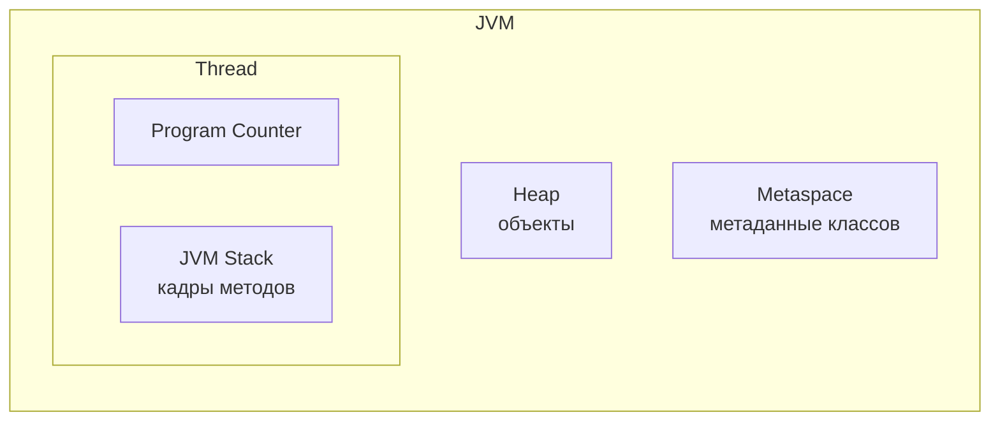

# 15. JVM, память и профессиональная разработка

## Оглавление
- [[#Пакеты|Пакеты]]
- [[#JAR|JAR]]
- [[#Модульная система|Модульная система]]
- [[#JVM|JVM]]
- [[#Память JVM|Память JVM]]
- [[#Создание и уничтожение объектов|Создание и уничтожение объектов]]
- [[#Garbage Collector|Garbage Collector]]
- [[#Ссылки|Ссылки]]
- [[#Class loading|Class loading]]
- [[#Reflection|Reflection]]
- [[#Аннотации|Аннотации]]
- [[#Документирование Javadoc|Документирование Javadoc]]
- [[#Assertions|Assertions]]
- [[#Тестирование|Тестирование]]
- [[#Сборка проектов|Сборка проектов]]
- [[#Отладка|Отладка]]
- [[#Логирование|Логирование]]
- [[#Базовые принципы дизайна|Базовые принципы дизайна]]

## Пакеты

### `package`

Пакет — пространство имён и логическая группировка классов:

```java
package com.example.app;   // в начале файла

class Main { }
```

Полное имя класса — `com.example.app.Main`.

### `import`

Импорт позволяет использовать короткое имя:

```java
import java.util.Scanner;   // или java.util.* — всё пакет

Scanner sc = new Scanner(System.in);
```

Классы из `java.lang` импортируются автоматически.

### Static import

Импорт статических членов:

```java
import static java.lang.Math.*;

double x = sqrt(16);   // вместо Math.sqrt
```

### Структура каталогов

Каталоги соответствуют пакетам: `com/example/app/Main.java`. `javac` и инструменты сборки ожидают такую структуру (см. [[#Сборка проектов|сборку]]).

### Полное имя класса

```java
java.util.List<String> list = new java.util.ArrayList<>();  // без import
```

## JAR

Архив `.jar` — сжатый набор `.class` и ресурсов.

### Создание

```text
jar cf app.jar -C out .
java -cp app.jar com.example.Main
```

### Manifest

Файл `META-INF/MANIFEST.MF` описывает архив; главный класс — для запуска `java -jar`:

```text
Main-Class: com.example.Main
```

```text
jar cfe app.jar com.example.Main -C out .
java -jar app.jar
```

### Classpath

Путь поиска классов: каталоги и jar через разделитель (`;` на Windows, `:` на Unix).

```text
java -cp "lib/a.jar;lib/b.jar" com.example.Main
```

## Модульная система

JPMS (Java 9) — модули как единицы с явными зависимостями.

### `module-info.java`

```java
module com.example.app {
    requires java.sql;                  // зависимость
    exports com.example.api;            // открыть пакет наружу
}
```

### `requires`, `exports`, `opens`, `uses`, `provides`

- `requires` — зависимость от другого модуля.
- `exports` — пакеты, доступные другим модулям.
- `opens` — пакеты, открытые для reflection (см. [[#Reflection|reflection]]).
- `uses` — потребление сервиса.
- `provides ... with ...` — поставка реализации сервиса.

Для большинства приложений достаточно `requires`/`exports`; модули дают строгие границы и компактные рантаймы (`jlink`, см. [[#Сборка проектов|сборку]]).

## JVM

Архитектура виртуальной машины (см. [[01. Основы языка Java#JDK, JRE и JVM|JDK/JRE/JVM]]).

### Class Loader

Загружает `.class` в память (см. [[#Class loading|class loading]]). Иерархия: Bootstrap, Platform, Application.

### Runtime Data Areas

Области памяти JVM: стек потока, heap (куча), Metaspace, регистры ПК, память нативных методов (см. [[#Память JVM|память]]).

### Execution Engine

Исполняет байт-код: интерпретация + JIT-компиляция.

### JIT-компиляция

Just-In-Time: часто выполняемые методы компилируются в машинный код «на лету» — отсюда производительность, сравнивая с нативными языками.

## Память JVM



### Heap

Куча — все объекты. Управляется сборщиком мусора (см. [[#Garbage Collector|GC]]).

### Stack

Стек каждого потока — кадры методов (локальные переменные, адреса возврата). Переполнение — `StackOverflowError` (см. [[04. Методы и параметры#Рекурсия|рекурсию]]).

### Metaspace

Метаданные классов (замена PermGen с Java 8). Растёт вне кучи.

### String Pool

Пул строк внутри heap (см. [[03. Массивы и строки#String Pool|String Pool]]). С Java 7 пул — часть кучи.

## Создание и уничтожение объектов


Объект создаётся `new` (см. [[05. Классы и объекты#Объекты и оператор new|new]]), уничтожается GC, когда становится недостижимым (см. [[#Garbage Collector|GC]]).

## Garbage Collector

Автоматическое управление памятью: освобождение объектов, на которые нет ссылок.

### Reachability и GC Roots

Живой объект достижим из корней GC: статических полей, локальных переменных на стеке, зарегистрированных нативных ссылок. Недостижимые — кандидаты на сборку.

### Young/Old Generation

Куча разделена поколениями: молодые объекты — Young (Eden + Survivors), пережившие сборки — Old.


### Основные сборщики мусора

| Сборщик | Особенности |
| --- | --- |
| Serial | один поток, малые приложения |
| Parallel | несколько потоков, throughput |
| G1 (по умолчанию) | предсказуемые паузы, регионы |
| ZGC | очень малые паузы, большие кучи; с Java 21 — generational |

## Ссылки

| Тип | Условие сборки | Применение |
| --- | --- | --- |
| Strong | никогда (пока есть) | обычные ссылки |
| Soft | при нехватке памяти | кэши |
| Weak | при ближайшей сборке | кэши, weak map |
| Phantom | только после финализации | управление очисткой ресурсов |

```java
WeakReference<String> ref = new WeakReference<>(new String("x"));
ref.get();   // null после сборки
```

## Class loading

Жизненный цикл класса: загрузка → связывание → инициализация.

### Loading

Чтение `.class` и создание объекта `Class` (см. [[#Reflection|reflection]]).

### Linking

Проверка, подготовка (выделение памяти под статики), разрешение ссылок.

### Initialization

Выполнение статических инициализаторов и блоков (см. [[05. Классы и объекты#Ключевое слово static|static]]).

## Reflection

Динамический доступ к классам в рантайме (`java.lang.reflect`).

### `Class`

```java
Class<?> cls = String.class;        // или obj.getClass()
cls.getName();                      // "java.lang.String"
```

### Получение полей, методов, конструкторов

```java
cls.getFields();           // public поля
cls.getDeclaredFields();   // все поля класса
cls.getMethods();
cls.getDeclaredConstructors();
```

### Создание объектов и вызов методов

```java
Class<?> cls = Class.forName("com.example.User");
Object obj = cls.getDeclaredConstructor().newInstance();

Method m = cls.getMethod("getName");
String name = (String) m.invoke(obj);
```

Reflection медленный и ломает проверки типов — использовать точечно (фреймворки, сериализация).

## Аннотации

### Встроенные аннотации

`@Override`, `@Deprecated`, `@SuppressWarnings`, `@FunctionalInterface` (см. [[06. Наследование и полиморфизм#Переопределение методов|override]], [[11. Лямбда-выражения и Stream API#Функциональные интерфейсы|функциональные интерфейсы]]).

### Создание собственных

```java
@interface Author {
    String name();
    int year() default 2026;
}

@Author(name = "Аня", year = 2026)
class MyClass { }
```

### `@Target`, `@Retention`

```java
import java.lang.annotation.*;

@Target(ElementType.METHOD)        // куда можно вешать
@Retention(RetentionPolicy.RUNTIME) // доступна ли в рантайме
@interface Loggable { }
```

`RetentionPolicy`: `SOURCE`, `CLASS`, `RUNTIME` (нужен для reflection).

### Reflection и аннотации

```java
Method m = cls.getMethod("doWork");
if (m.isAnnotationPresent(Loggable.class)) {
    Loggable a = m.getAnnotation(Loggable.class);
    // ...
}
```

## Документирование Javadoc

Комментарии `/** ... */` → HTML-документация (см. [[01. Основы языка Java#Комментарии|комментарии]]).

### `@param`, `@return`, `@throws`, `@see`

```java
/**
 * Вычисляет площадь круга.
 *
 * @param radius радиус
 * @return площадь
 * @throws IllegalArgumentException если radius < 0
 * @see Math#PI
 */
double area(double radius) { ... }
```

Теги: `@param` — параметр, `@return` — возврат, `@throws` — исключение, `@see` — ссылка. `{@link ...}` — ссылка в тексте.

## Assertions

### `assert`

Проверка инвариантов в отладке; отключается флагом `-ea`/`-da` (по умолчанию выключены в рантайме).

```java
assert x >= 0 : "x не может быть отрицательным";
```

Ассерты не заменяют валидацию входных данных (та — исключениями, см. [[08. Исключения и обработка ошибок#throw|throw]]).

## Тестирование

### Unit tests

Автоматические проверки отдельных единиц кода. Стандарт — JUnit.

### JUnit

```java
import org.junit.jupiter.api.Test;
import static org.junit.jupiter.api.Assertions.*;

class CalculatorTest {
    @Test
    void addsTwoNumbers() {
        assertEquals(5, new Calculator().add(2, 3));
    }
}
```

### Assertions

`assertEquals`, `assertTrue`, `assertNotNull`, `assertThrows`, `assertAll` и др.

### Test lifecycle

`@BeforeEach`, `@AfterEach`, `@BeforeAll`, `@AfterAll` — подготовка и очистка.

### Parameterized tests

Один тест — много наборов данных:

```java
@ParameterizedTest
@ValueSource(ints = {1, 2, 3})
void testWith(int arg) { ... }
```

## Сборка проектов

### Maven

Декларативная сборка: `pom.xml` описывает зависимости и плагины.

```xml
<dependencies>
    <dependency>
        <groupId>org.junit.jupiter</groupId>
        <artifactId>junit-jupiter</artifactId>
        <version>5.10.2</version>
        <scope>test</scope>
    </dependency>
</dependencies>
```

```text
mvn clean test      # компиляция + тесты
mvn package         # сборка jar
```

### Gradle

Декларативно-императивная сборка на Groovy/Kotlin (`build.gradle`).

```groovy
dependencies {
    testImplementation 'org.junit.jupiter:junit-jupiter:5.10.2'
}
```

### Dependencies

Внешние библиотеки подтягиваются из репозиториев (Maven Central). Версии — в централизованном виде.

### Build lifecycle

Типовой цикл: compile → test → package → install. Папки: `src/main/java`, `src/test/java`, `target`/`build`.

### jlink и jpackage

- `jlink` — собирает компактный рантайм с нужными модулями (см. [[#Модульная система|модули]]).
- `jpackage` — нативные установщики (`.msi`, `.dmg`, `.deb`) из приложения.

## Отладка

### Breakpoints

Точки останова — пауза выполнения в нужной строке (в IDE, отладчик JDB).

### Step into / Step over

- Step into — войти в вызываемый метод.
- Step over — выполнить вызов целиком, не входя.

### Watches

Выражения, значения которых отслеживаются в отладчике.

### Stack trace

Трасса исключения показывает цепочку вызовов:

```java
e.printStackTrace();   // или логировать через SLF4J
```

Первая строка — место броска; дальше — вызывающие кадры (см. [[08. Исключения и обработка ошибок#Цепочки исключений|цепочки исключений]]).

## Логирование

### Уровни логов

`TRACE < DEBUG < INFO < WARN < ERROR`. Уровень фильтрует сообщения.

### SLF4J

Абстракция логирования:

```java
import org.slf4j.Logger;
import org.slf4j.LoggerFactory;

private static final Logger log = LoggerFactory.getLogger(MyClass.class);

log.info("Обработка запроса {}", id);
log.error("Ошибка БД", exception);
```

### Logback

Популярная реализация SLF4J; конфигурация в `logback.xml` (формат, уровень, файлы).

## Базовые принципы дизайна

### SOLID

- **S**ingle responsibility — один класс, одна причина для изменения.
- **O**pen/closed — открыто для расширения, закрыто для изменения.
- **L**iskov substitution — подклассы заменяемы суперклассом (см. [[06. Наследование и полиморфизм#Полиморфизм|полиморфизм]]).
- **I**nterface segregation — узкие интерфейсы вместо «толстых» (см. [[07. Интерфейсы, enum, record и sealed#Интерфейсы|интерфейсы]]).
- **D**ependency inversion — зависеть от абстракций, не от реализаций.

### DRY

Don't Repeat Yourself — не дублировать логику; выносить общее.

### KISS

Keep It Simple — простота предпочтительнее изобретательности.

### YAGNI

You Aren't Gonna Need It — не добавлять функциональность заранее.

### Composition over inheritance

Композиция предпочтительнее наследования (см. [[06. Наследование и полиморфизм#Наследование против композиции|наследование против композиции]]).

### Immutability

Неизменяемые объекты безопасны и предсказуемы (см. [[05. Классы и объекты#Неизменяемые объекты|неизменяемость]], [[07. Интерфейсы, enum, record и sealed#Record|record]]).

### Dependency inversion

Код зависит от интерфейсов; конкретные реализации подставляются (DI-контейнеры, фабрики).
